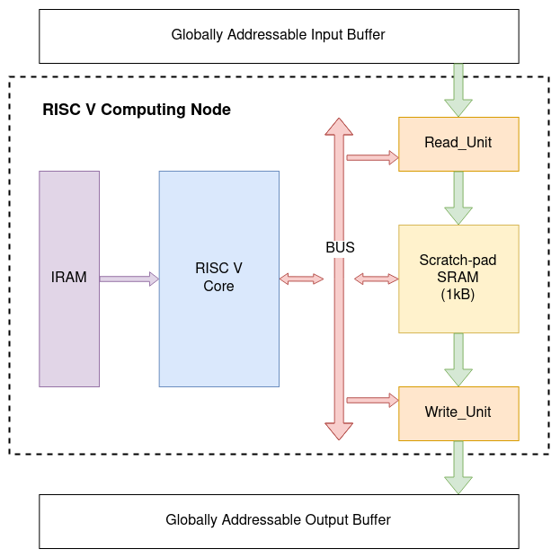

# RISCV-based AlImp Design Tutorial

## Introduction

## Programming Model

Algorithms with intensive control flow or scalar computation should be mapped on processor-like computation nodes. Vesyla-suite support the mapping of algorithms to RISC-V processor. The RISC-V based computation nodes have the same I/O interface as the DRRA-based computation nodes to communicate with a globally addressable input buffer and a globally addressable output buffer, as shown in the following figure.



The input buffer is used to store the input data of the algorithm. The output buffer is used to store the output data of the algorithm. The input buffer and the output buffer are connected to the RISC V computation node through the input and output ports of the fabric. The input and output ports are used to connect the RISC V to the outside world.

Currently, we assume that RISC V core accesses both input and output buffer through peripheral interface: the read_unit and write_unit. The bandwith of the read_unit and write_unit are fixed as 1 channel because a RISC V core only has 1 thread. The wide bandwidth of the input and output ports are more than enough for the RISC V core. The RISC V core considers the read_unit and write_unit as memory mapped peripheral devices. Each of them has a 64-bit configuration register that can be accessed by the RISC V core via the bus. The address for the read_unit configuration register is ``0x80000000``, and the write_unit configuration register is ``0x80000008``. All data are organized in **little endian** style. The configuration register fields are shown in the following table.

| Field Name (MSB to LSB) | Bit Width | Description |
| ----------------------- | --------- | ----------- |
| enable                  | 1         | Enable the read_unit or write_unit. |
| addr_ext                | 25        | The address of the input or output buffer. |
| addr_int                | 5         | The address of the internal SRAM. |
| unused                  | 1         | Unused. |
| step_ext                | 5         | The step size of the input or output buffer. |
| step_int                | 5         | The step size of the internal SRAM. |
| iter                    | 5         | The number of iterations. |
| unused                  | 17        | Unused. |

There is a 1 kB scratch-pad SRAM array working as the main data memory for the RISC V core. The RISC V core can access the SRAM array through the load and store instructions. The read_unit and write_unit can also bring data from or store data to the outside world.

The assumption of giant globally addressable memory buffers is not realistic. However, these buffers will not be implemented as it is. Instead, application-level synthesis (ALS) tool will synthesize the input and output buffers to the actual hardware. The input and output buffers are used to simplify the algorithmic compilation process.

## Initialization

In any directory, you can initialize a vesyla-suite project for RISC V by using the command:

```tcl
vs-init -s vs-rvsim
```

If this directory has already been initialized, you can force the re-initialization by using the command:

```tcl
vs-init -f -s vs-rvsim
```

You will notice that several files has been created in this directory. One of the files is ``config.json``. This file contains the configuration of the vesyla-suite project. You can modify this file to change the configuration of the project. The configuration file is described in the following section.

Another file you need to modify is ``main.cpp.jinja2``. This file is a template file used to generate the ``main.cpp`` file. You need to define some of the functions in this file. The functions are described in the following section.

The last file you need to modify is ``instruction.bin``. This file contains the instructions of the RISC V core in binary or hex form. You need to generate the instructions and write them to this file. The easiest way is to write assembly code and compile it by using RISC V assembler.

## Implementation

We use a simple example to demonstrate the implementation of algorithms. The example is a element-wise addition of two vectors. It has two inputs: vector ``A`` and vector ``B``. It has one output: vector ``C``. All of them have size equal to 16. The element-wise addition is defined as: ``C[i] = A[i] + B[i]``.

We first define the hardware architecture in ``config.json``.

```json
{
  "style": "vs-rvsim",
  "ARCH_IO_DEPTH": 1024,
  "ARCH_IO_WIDTH": 256,
  "ARCH_SRAM_SIZE": 1024,
  "ARCH_IRAM_SIZE": 1024
}
```

``ARCH_IO_DEPTH`` is the depth of each input and output buffer. ``ARCH_IO_WIDTH`` is the width of each input and output buffer in terms of bits. ``ARCH_SRAM_SIZE`` is the size of SRAM in terms of bytes.``ARCH_IRAM_SIZE`` is the depth of the instruction RAM in terms of bytes.

Before we implement the algorithm in ``main.cpp.jinja2``, we need to define the input and output data layout in input and output buffer. Both input and output buffer has width that equals to 256 bits. So, each row can be divided by 16 16-bit chunks, each of which stores an element of ``A``, ``B``, or ``C``. The layout is described by the following table.

```
Input Buffer:
+------+-----+-----+-----+-----+-----+-----+-----+-----+-----+-----+-----+-----+-----+-----+-----+-----+
| addr | CHK0| CHK1| CHK2| CHK3| CHK4| CHK5| CHK6| CHK7| CHK8| CHK9|CHK10|CHK11|CHK12|CHK13|CHK14|CHK15|
+------+-----+-----+-----+-----+-----+-----+-----+-----+-----+-----+-----+-----+-----+-----+-----+-----+
|    0 | A[0]| A[1]| A[2]| A[3]| A[4]| A[5]| A[6]| A[7]| A[8]| A[9]|A[10]|A[11]|A[12]|A[13]|A[14]|A[15]|
|    1 | B[0]| B[1]| B[2]| B[3]| B[4]| B[5]| B[6]| B[7]| B[8]| B[9]|B[10]|B[11]|B[12]|B[13]|B[14]|B[15]|
+------+-----+-----+-----+-----+-----+-----+-----+-----+-----+-----+-----+-----+-----+-----+-----+-----+

Output Buffer:
+------+-----+-----+-----+-----+-----+-----+-----+-----+-----+-----+-----+-----+-----+-----+-----+-----+
| addr | CHK0| CHK1| CHK2| CHK3| CHK4| CHK5| CHK6| CHK7| CHK8| CHK9|CHK10|CHK11|CHK12|CHK13|CHK14|CHK15|
+------+-----+-----+-----+-----+-----+-----+-----+-----+-----+-----+-----+-----+-----+-----+-----+-----+
|    0 | C[0]| C[1]| C[2]| C[3]| C[4]| C[5]| C[6]| C[7]| C[8]| C[9]|C[10]|C[11]|C[12]|C[13]|C[14]|C[15]|
+------+-----+-----+-----+-----+-----+-----+-----+-----+-----+-----+-----+-----+-----+-----+-----+-----+
```

In ``main.cpp.jinja2``, you need to implement the following functions:

* ``void init()``: This function is used to initialize the input buffer.
* ``void model_l0()``: This function is used to implement the algorithm in the level 0 model. It's a pure software implementation of the algorithm. It's used to verify the correctness of the algorithm.

We implement these functions one by one.

The ``init()`` function is used to initialize the input buffer. It's a pure software implementation. The following code shows how to initialize the input buffer.

```cpp
void init(){
  // Set the seed for random number generator
  srand((unsigned) time(NULL));

  // Generate 32 random numbers in range [0,100) for both vector A and B
  vector<int16_t> v(32);
  for(auto i=0; i<32; i++){
    v[i] = rand()%100;
  }

  // Write the random numbers to the input buffer at starting address 0, and the number of row to write is 2.
  __input_buffer__.write<int16_t>(0, 2, v);
}
```

The ``model_l0()`` function is used to implement the algorithm in the level 0 model. It's a pure software implementation of the algorithm. It's used to verify the correctness of the algorithm. The following code shows how to implement the algorithm in the level 0 model.

```cpp
void model_l0(){
  // Read the input buffer to A. The starting address is 0, and the number of row to read is 1. 
  vector<int16_t> a = __input_buffer__.read<int16_t>(0, 1);
  // Read the input buffer to B. The starting address is 1, and the number of row to read is 1. 
  vector<int16_t> b = __input_buffer__.read<int16_t>(1, 1);
  // Add A and B
  vector<int16_t> c(16);
  for(auto i=0; i<16; i++){
    c[i] = a[i] + b[i];
  }
  // Write the result C to the output buffer at starting address 0, and the number of row to write is 1.
  __output_buffer__.write<int16_t>(0, 1, c);
}
```

Now, it's time to get the instructions for RISC V core. We first write the assembly code as following:

```asm
lui x1, 0x80000       # load the base address of read_unit and write_unit conf reg 
lui x2, 0x80000       # composing the configuration words for read_unit:
lui x3, 0x08440       # enable=1, addr_ext=0, addr_int=0, step_ext=1, step_int=1, iter=2
sw x3, 0(x1)          # write to conf reg, lower half
sw x2, 4(x1)          # write to conf reg, upper half

addi x4, x0, 32       # offset address boundry, used for loop end condition
addi x5, x0, 0        # loop iterator, also work as address
__back:
lh x7, 0(x5)          # load one element in A (16-bit)
lh x8, 32(x5)         # load one element in B (16-bit)
add x7, x7, x8        # add
sh x7, 64(x5)         # store the result
addi x5, x5, 2        # update iterator by 2 since 16-bit is 2 bytes
blt x5, x4, __back    # check loop condition and jump
__done:

lui x2, 0x80000       # composing the configuration words for read_unit:
addi x2, x2, 0x004    # enable=1, addr_ext=0, addr_int=2, step_ext=1, step_int=1, iter=1
lui x3, 0x08420       
sw x3, 8(x1)          # write to conf reg, lower half    
sw x2, 12(x1)         # write to conf reg, upper half  

addi x0, x0, 0        # NOP, wait the data transfer to complete
addi x0, x0, 0        # NOP, wait the data transfer to complete
```

Then, we use the [online RISC V assembler](https://riscvasm.lucasteske.dev/) to compile and get the hex instructions. The following figure shows the result.

```hex
800000b7
80000137
084401b7
0030a023
0020a223
02000213
00000293
00029383
02029403
008383b3
04729023
00228293
fe42c6e3
80000137
00410113
084201b7
0030a423
0020a623
00000013
00000013
```

## Simulation and Verification

To simulate the algorithm, simply run:

```tcl
./run.sh
```

If the output shows the simulation is successful, then the algorithm is correct.