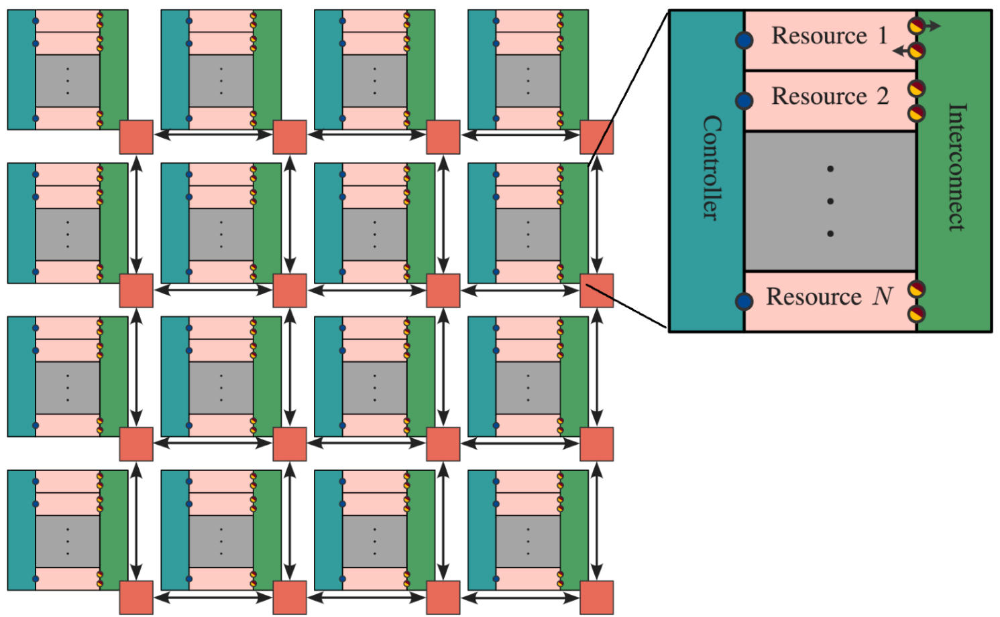
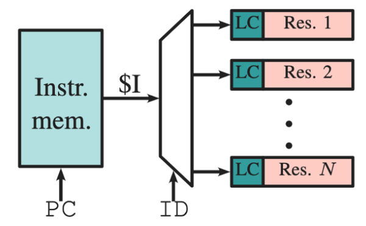

# DRRA Overview

The DRRA design focuses on solving the problems faced by the DRRA-1 fabric. The DRRA fabric is also a CGRA fabric similar to the DRRA-1 fabric. However, we do not distinguish storage and computation fabric anymore. Any cell in DRRA can be either a computation cell, or a storage cell, or even a hybrid cell.

Inside each cell, there is a single cell-level controller called sequencer, just like the DRRA-1 cell. However, different from DRRA-1, there is no pre-designed resources in each cell. Instead, each cell has 16 resource slots, the system designer can plug in any available resources in any of those slots.

The cells in DRRA fabric are connected by NoCs. We keep a simple nearest neighbor connection scheme instead of a sliding window scheme (used in DRRA-1) to simplify the interconnection cost.

The following figure shows the architecture of DRRA fabric. Readers can clearly see the internal components in each cell.

The DRRA ISA's instruction space is divided into two categories: controller instructions and resource instructions. The cell-level controller decodes the controller instructions. The resource instructions are sent to a specific slot inside the cell and will be decoded by the local controller in that slot. As shown in the following figure, The two-stage decoding process for resource instructions makes the instruction decoding logic extremely simple. On cell-level decoding, the controller simply forwards the instruction payload to a specific slot. While the slot-level controller only decodes 1 or 2 types of instructions that can run on the corresponding resources. Compared to a single-stage decoder like the controller in modern microprocessors, the DRRA decoding scheme is much simpler.

