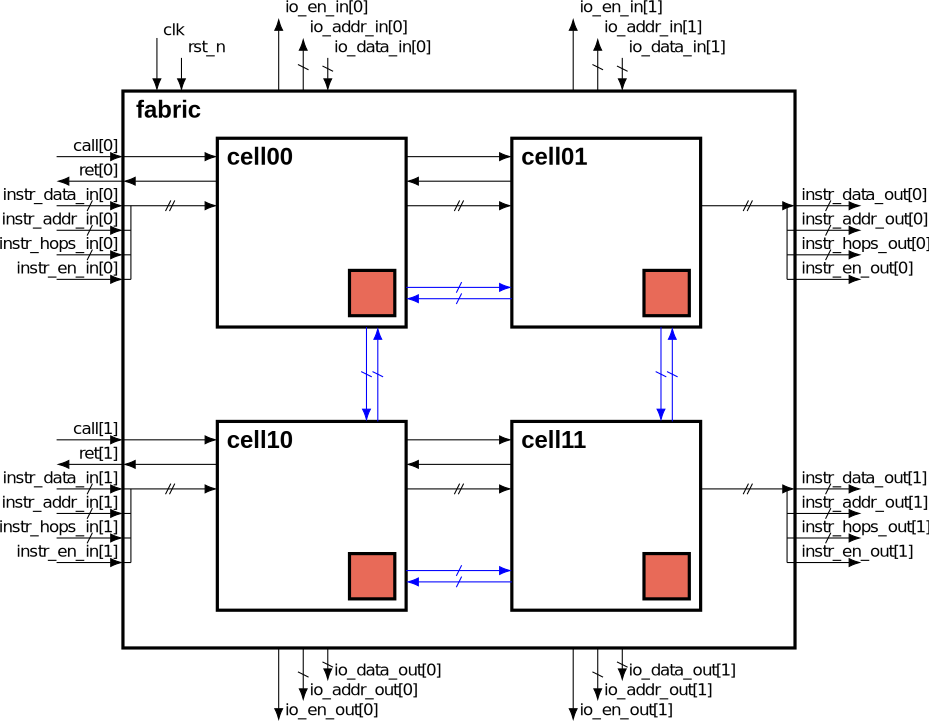
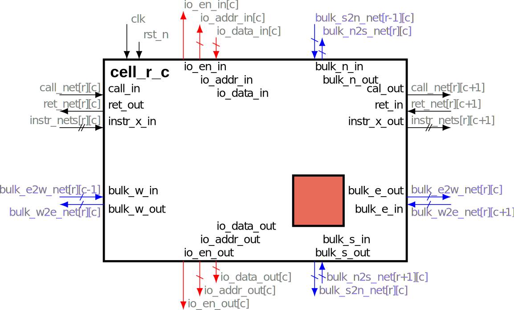
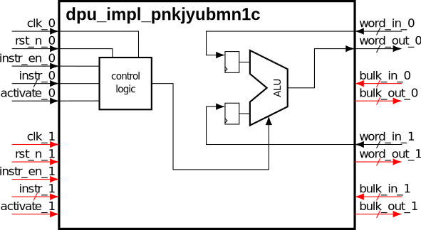

# DRRA Schematics

The following colour convention applies here.
On arrows, black is used for signal that come from outside the fabric, blue is used for parts accessible only inside the fabric and red for optional connections.
On names, black is used for port names, while net names are in a lighter colour (grey or light blue).

## Fabric level schematic

The following schematic represent a generic fabric top level interconnections.
The example is given for a generic 2×2 fabric.
Checked on DRRA_component v2.9.1.

Instruction ports (call, ret, and instruction data, addr, hops, and en) spread horizontally on each row.
IO data ports are only present at the top and bottom of the fabric.
Intermediate rows (not present on 2×2) would not be connected to any IO.
Fabric data input is at the top and output at the bottom (see [Full System (AlImp) View](../../../ToolChain/Vesyla/Explanations/FullSystemView.md)).

The red square is the same router as in the [Architecture Overview](../../Explanations/DRRA/Overview.md).

The *bulk_intercell* network is represented by blue arrows and is only accessible by cells inside the fabric.

## Cell level schematic

The following schematic represents a generic cell inside a fabric.
Checked on DRRA_component v2.9.1.

The cell instantiation name is cell_[row_number]_[column_number], starting from (0,0) at the top left of the fabric.
The signal *instr_nets* is the previous compaction of data, addr, hops and en.

The names of bulk net and bulk port on the schematic omit "intercell" (e.g., it is *bulk_intercell_n2s_net* or *bulk_intercell_s_out* in verilog).
Indices [r][c] of bulk nets are determined by the cell controlling them, i.e. coming from the ports bulk_x_out of cell_r_c.

## DPU schematic
The following schematic gives a simplified representation of the DRRA2 DPU on v2.9.1.

The DPU occupies 2 resource slots. The red ports correspond to the generic resource slots not used on the DPU.

As data input, the ALU may use internal registers instead of the registered word input (e.g. for MAC function). Those internal registers are not represented here.

The control logic consists mostly of the fsm, memory for the mode, and logic to decode input instructions and program the DPU.
