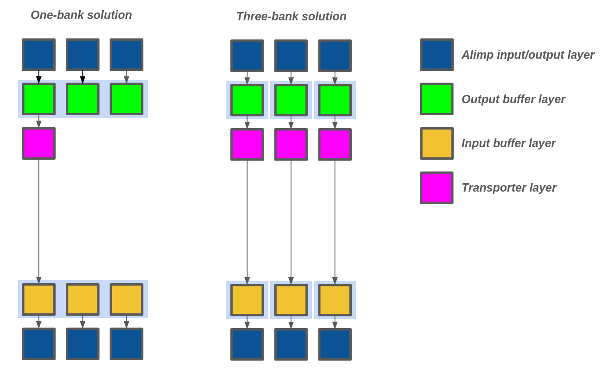
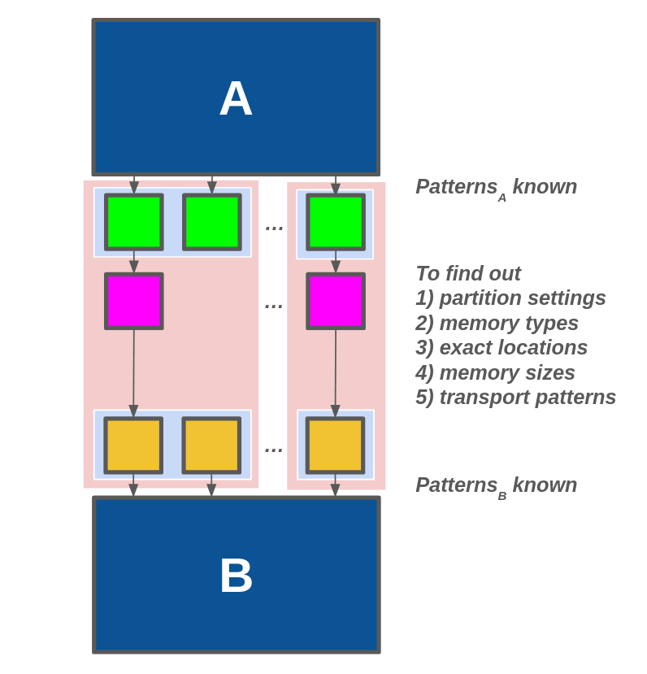
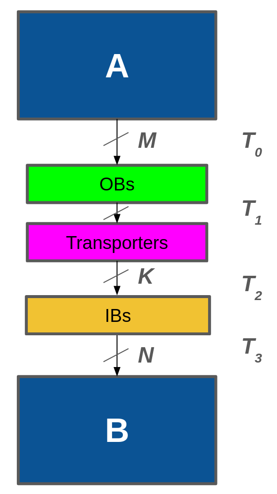

# Memory Synthesis

## Main concept 

From the previous steps, the tool models the schedule and estimated memory characteristics of each edge. Here what this step needs to address is that A) it needs to assign the type of memories inuse, B) it precisely assigns the positions for output buffers, transporters, and input buffers, C) it addresses how many communication channels needed to transfer data from one section of the output to the corresponding section of the input, D) in those communication channels, it assigns the time slot for each token to travel on one of the channels.

Running the memory synthesis can also be beneficial in a way that it can leverage many valid solutions and return the most cost-effective one from that list. In the below figure, for example, it presents two possible solutions for the given requirement. One thing that cannot be touched is the Alimp library where it tells from which channel of the output Alimp a token is sent and to which channel of the input Alimp that token is received, along with the timestamps for both input and output. Here, we can see that three output and input channels need to be connected the output/input buffers. However, what can be manipulated and determined to find a good solution is that how we partition the memory and which type of memory we use. 

In this example, the one-bank solution uses one giant memory for both input and output where the output memory needs to be a 3x1 register file, and vice versa for the input memory. For this to work, we may only need one communication channel (one transporter) to connect from output to input. Assuming that there is another valid solution where we can place three 1x1 fifos to both output and input buffer layers, with three transporters and channels to connect them. To evaluate which design is better, it requires a cost function which factors in the cost of memory, type of memory, size of memory, and cost of communication channels. Without this cost function, we cannot really tell whether the one-bank solution or the three-bank solution is better, which is essentially the task of memory synthesis. 



### Goals

Next, we would like to tell what we exactly know and what needs to be determined in this step. In the GLIC synthesis, a set of information about the patterns and memory has been pre-determined because in that step, we assumed that the memory for both sides is one big register file with infinite number of input and output ports, similar to the one-bank solution above. This is however unrealistic because such imaginary register file is unimplementable, or is but with great cost. So, the following are fixed/estimated information that we obtained from GLIC synthesis.

1. Start times (fire times) of every node - These variables are fixed.
2. Output and Input patterns of each edge - since the fire times are known and patterns are defined by an HLS library, the output and input patterns (address, time, and channel) can be calculated as fixed integers. In the example below, these patterns are $Patterns_{A}$ and $Patterns_{B}$.
3. The fixed delay for transporting data from A to B.
4. The estimated number of communication channels for connecting A and B.
5. The esttimated buffer sizes of the input and output buffers.

The following are the questions that need to be answered using the above information as hard and soft constraints - hard constraints are the patterns and soft constraints being the estimated buffer sizes, etc.

1. Partition settings - If segmenting a big connection problem into many smaller problems is possible, we always want to do as the implemention cost is likely lower.
2. Memory types - For each partition, the output and input memories are required to be assigned the memory type, more details about this later.
3. Exact locations - For all three components - output buffers, input buffers, and transporters, they are assigned the positions, where all of them consume one DRRA cell height, a transporter has a width of one DRRA cell, and buffers have a width of a multiple of one DRRA cell.
4. Memory sizes - Finding which size is suitable for each memory. Previously, the estimated sizes were assigned as any integer, but this cannot be put into practice as the memory size should be a multiple of two. Here, the problem works out which valid memory size of each memory should be.
5. Transport patterns - For each partition, there could be a case where it uses more than one communication channel. So, it is necessary to know that which communication channel a token uses, at which time this token is sent out from the output buffer, and also from which/to which channel this token is transferred.




### Memory type

Now, we have three memory models to mimic the digital hardware, each has its own properties as following 

- FIFO: one input port, one output port.
- RAM: one/two input ports, one/two output ports. 
- Register file: infinite input ports, infinite output ports.

We assume that there's no upper limit of how large a memory could become, but it must has the size of a multiple of two. Of course, this does not sound realistic. We'll add limitations later. 

### Partition

To find out the smallest partitions, a parition has to satisfy these rules - 1) all data tokens from all input channels of a partition can be transported to the input channels inside this partition only, 2) input/output channels cannot overlap between partitions, e.g., partitioning a list of output channels as [0, 1, 3], [2, 4, 5] would be incorrect because output channel 2 overlaps the first partition, so they need to merge into one parition. 

All possible partition settings of a set of smallest partitions {A,B,C,D} would be below list

```
[[A,B,C,D], [AB,C,D], [A,BC,D], [A,B,CD], [ABC,D], [A,BCD], [ABCD]]
```


## Solving the problem

### Configuration problem

Since the problem has so many variables and some of them even have so many constraints to follow, such as setting the memory type to fifo has to include the constraints to model the fifo behaviour, this pushes the constraint solver to the point where it cannot solve the problem in one go. So, instead of finding out all answer in one problem, we think of the big problem as small problems that answer only one or two questions at a time, and do this in a nested loop.

This is how we break down the big problem:

1. Select only a certain number of partition settings and loop over to find out which partition setting gives the lowest cost.
2. For each setting, loop over every partition in the setting.
3. For each parition, it is now possible to define a set of memory type for a pair of input and output buffers. Then loop over every hardware configuration to find the lowest hardware setting. 
4. Solve the problem to get the cost of the current setting.

```
partition_best_cost = [];
for partition_setting in all_possible_partitions {
	segment_best_cost = [];
	for partition in partition_setting {
		best_cost = MAX;
		for config in configs {
			cost = solving(current); 
			if cost < best_cost {
				best_cost = cost;
			} 
		}
		segment_best_cost.add(best_cost);
	}
	partition_best_cost.add(segment_best_cost);
}			
```


After getting the result, we can easily work out which partition setting and memory types of the input and output buffers we need to use. Then, we solve the problem again but this time for the setting that gives the lowest cost result, and hence, we solve the problem. 


### Scheduling problem

This section deals with, given the settings and hard constraints, how do we come up with the answers to the transport patterns, memory sizes, and exact locations. 

The model is similar to what we did with GLIC synthesis. The crucial timing patterns are $T_{0}$, $T_{1}$, $T_{2}$, and $T_{3}$. For $T_{0}$ and $T_{3}$, they are the output and input time patterns and hence are fixed integers. What we need to solve for is $T_{1}$ and $T_{2}$, which is the time the transporters send a read to each token in OBs, and the time a data token arrives at IBs, respectively. The relation between $T_{1}$ and $T_{2}$ is quite simple - we need to just determine $T_{1}$, and $T_{2}$ is said to be "$T_{1} + communication\_fixed\_delay$".
 


However, we write those timing patterns in matrix. For example, 

$$
\text{T}_{0} = \begin{bmatrix}
1 & 2 & -1 & -1 & -1 & -1 & ... & 100 & -1\\
-1 & -1 & 3 & 4 & -1 & -1 & ... & -1 & 101\\
. & . & . & . & .  & . & ... & . & . \\
. & . & . & . & .  & . & ... & . & . \\
-1 & -1 & -1 & -1 & 5 & 6 & ... & -1 & -1
\end{bmatrix}
$$

- $T_{0}$ has $TOKEN\_SIZE$ columns and $M$ rows (number of output channels).
- $T_{1}$ has $TOKEN\_SIZE$ columns and $K$ rows (maximum number of communication channels).
- $T_{2}$ has the dimension as $T_{1}$.
- $T_{3}$ has $TOKEN\_SIZE$ columns and $N$ rows (number of input channels).

Explaination on how this matrix works

1. Each column represents an address of a data token.
2. Each non-zero number represents the absolute time that the token takes an action.
3. Each column must have only one non-zero integer.
4. A row must contain at least one non-zero integer to indicate that the channel (row index) is used at some time, except for $T_{1}$ and $T_{2}$ that the tool may want to empty some rows to lower the cost function by using less communication channels.  

For example, $T_{0}[1][2] = 3$ means the token of address 2 is sent from channel 1 at time 3. 

#### Cost function 

Here, the solver tries to minimise the cost of implementing buffers both input and output, and the cost of having communication wires. For the memory cost, it needs to get the $memory\_cost$, which varies from type to type, take the memory size into account, and factor in the number of ports used.

```
% objective
% define costs of memory
var int: cost_output_buffers =
    memory_cost[1] * ob_cap * (ob_in_ports + ob_out_ports);

var int: cost_input_buffers =
    memory_cost[2] * ib_cap * (ib_in_ports + ib_out_ports);

var int: cost_wire = comm_width_cost * comm_cap;

var int: cost_function = cost_output_buffers + cost_input_buffers + cost_wire;
solve minimize cost_function;

```


#### Formulate the constraints

Add constraints to limit what numbers inside $T_{1}$ can be according to the matrix rules.

```
% Each column has one non -1 value
constraint forall(j in 1..WINDOW_SIZE)(
    sum(i in 1..MAX_K)(bool2int(T1[i,j] != -1)) = 1
);
    
% Each row has unique non -1 value
constraint forall(i in 1..MAX_K, j1, j2 in 1..WINDOW_SIZE where j1 < j2)(
    (T1[i,j1] != -1 /\ T1[i,j2] != -1) -> T1[i,j1] != T1[i,j2]
);
```

Bind $T_{1}$ to $T_{2}$

```
constraint forall(i in 1..MAX_K, j in 1..WINDOW_SIZE)(
    if T1[i,j] != -1 then
        T2[i,j] = T1[i,j] + comm_delay
    else
        T2[i,j] = -1
    endif
); 
```


Add new variables such as D01, D01_START, D01_END, D23, D23_START, and D23_END, by flattening into vectors to represent the selection of connecting $T_{0}$ to $T_{1}$ and also $T_{2}$ to $T_{3}$. This can be done by the following constrinats. (We do the same for $T_{2}$ and $T_{3}$)

```
constraint forall(j in 1..WINDOW_SIZE)(
    let {
        % i1 is a valid input channel and i2 is an output channel
        var int: selected_i1 = sum(i1 in 1..M, i2 in 1..MAX_K)(
            i1 * bool2int(T0[i1,j] != -1 /\ T1[i2,j] != -1)
        );
        var int: selected_i2 = sum(i1 in 1..M, i2 in 1..MAX_K)(
            i2 * bool2int(T0[i1,j] != -1 /\ T1[i2,j] != -1)
        );
    } in 
    if (selected_i1 != 0 /\ selected_i2 != 0) then
        D01[j] = T1[selected_i2, j] - T0[selected_i1, j] /\
        D01[j] >= 1 /\
        D01_START[j] = T0[selected_i1, j] /\
        D01_END[j] = T1[selected_i2, j] 
    else 
        D01[j] = 0 /\
        D01_START[j] = 0 /\
        D01_END[j] = 0 
    endif
);

constraint forall(j in 1..WINDOW_SIZE)(D01[j] != 0);
```

Add constraints to force the buffer sizes to be a multiple of two. 
```
var 1..16: ob_cap_power;
var 1..16: ib_cap_power;
constraint (ob_cap = 2 ^ ob_cap_power);
constraint (ib_cap = 2 ^ ib_cap_power);
```


Determine how many communication channels are allocated. 
```
% bind the variable to minimize the channel size 
constraint forall(i in 1..MAX_K)(
    comm_used[i] <-> exists(j in 1..WINDOW_SIZE)(T1[i,j] != -1) 
);

% geometry constraints - start placing transporters from position 0..K
constraint forall(i in 2..MAX_K)(
    comm_used[i-1] >= comm_used[i]
);

% get communication capacity
constraint comm_cap = sum(i in 1..MAX_K)(bool2int(comm_used[i]));

% map to input/output ports
constraint (
    ob_out_ports = comm_cap /\
    ib_in_ports = comm_cap
);
```


Apply NDF ordering to pressure the OB (use less memory in IB)
```
constraint forall(k in 1..WINDOW_SIZE-1)(
    D01_END[SORTED_T3[k]] <= D01_END[SORTED_T3[k + 1]]
);
```


Add constraints for limiting the buffer size for both memories.
```
constraint cumulative(
    [D01_START[i]| i in 1..WINDOW_SIZE],
    [D01[i]| i in 1..WINDOW_SIZE],
    [1 | i in 1..WINDOW_SIZE],
    ob_cap
);

constraint cumulative(
    [D23_START[i]| i in 1..WINDOW_SIZE],
    [D23[i]| i in 1..WINDOW_SIZE],
    [1 | i in 1..WINDOW_SIZE],
    ib_cap
);

```

Model the fifo if the hardware configuration requests
```
% output fifo
constraint forall(j in 1..WINDOW_SIZE-1)(
    D01_END[SORTED_T0[j]] < D01_END[SORTED_T0[j + 1]]
);

% input fifo
constraint forall(j in 1..WINDOW_SIZE-1)(
    D23_START[SORTED_T3[j]] < D23_START[SORTED_T3[j + 1]] 
);
```


#### Window sliding 

As you can see, the problem grows rapidly when the number of tokens increases. So, we set a threshould to a certain number that slices the problem into many windows. This of course sacrifices the global view and the chance of getting to the optimal solution, but it guarantees to find a solution locally and combines the solutions to answer that big problem.  

For the first chunk of the small problems, it can use the same model as described above, but for the later small problems, we need to use information about $T_{0}$, $T_{1}$, $T_{2}$, and $T_{3}$ from previously solved problems to constraint the current problem in a way that it does not break the hard constraints.

We add to the following hard constraints for getting the number of communication channels, limiting buffer sizes, and modeling fifo.

```
% preserve the constraint where each channel can be used to send only one token at a time
constraint if PREVIOUS_SIZE != 0 then 
    forall(i in 1..MAX_K, j1 in 1..WINDOW_SIZE, j2 in 1..PREVIOUS_SIZE)(
        (T1[i,j1] != -1 /\ PREV_T1[i,j2] != -1) -> T1[i,j1] != PREV_T1[i,j2]
    )
endif;

% bind the variable to minimize the channel size 
constraint forall(i in 1..MAX_K)(
    comm_used[i] <-> (
        exists(j in 1..WINDOW_SIZE)(T1[i,j] != -1) \/
        exists(j in 1..PREVIOUS_SIZE)(PREV_T1[i,j] != -1) 
    )
);

% constraints for limiting buffer size for OB
constraint cumulative(
    [
        if i <= PREVIOUS_SIZE then 
            PREV_D01_START[i] 
        else 
            D01_START[i - PREVIOUS_SIZE] 
        endif 
        | i in 1..PREVIOUS_SIZE + WINDOW_SIZE
    ],
    [
        if i <= PREVIOUS_SIZE then 
            PREV_D01[i]  
        else 
            D01[i - PREVIOUS_SIZE]  
        endif
        | i in 1..PREVIOUS_SIZE + WINDOW_SIZE
    ],
    [
        1 | i in 1..PREVIOUS_SIZE + WINDOW_SIZE
    ],
    ob_cap
);

% modeling output fifo
constraint forall(j in 1..WINDOW_SIZE-1)(
    D01_END[SORTED_T0[j]] < D01_END[SORTED_T0[j + 1]]
);

% 1) constraint that previous final write time < current first wirte time 
constraint if PREVIOUS_SIZE != 0 then
    PREV_D01_START_LAST < D01_START[SORTED_T0[1]]
endif;

% 2) constraint that previous final read time < current first read time 
constraint if PREVIOUS_SIZE != 0 then
    PREV_D01_END_LAST < D01_END[SORTED_T0[1]]
endif;
```