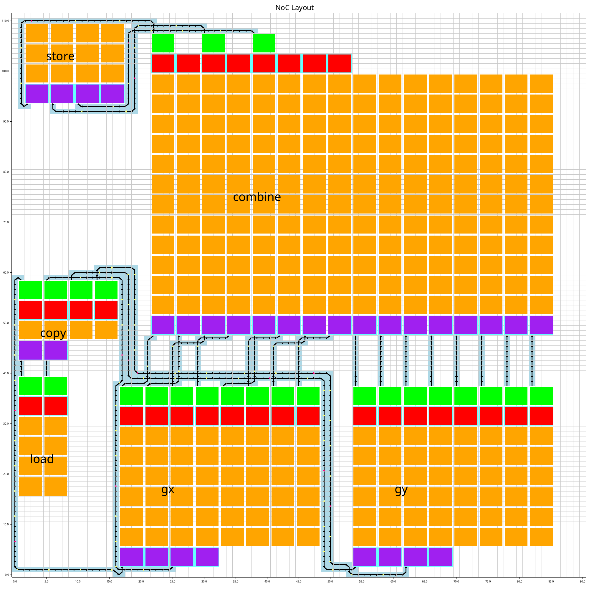

# Noc ReSynthesis

## Main concept

Due to the fact that routing wires have been reassigned or newly added, it is necessary to ensure that new routing wires also satisfy the NoC requirements for both timing delay and slew rate.  

In this step, the input is a fully wired component with exact lengths. The NoC Resynthesis must insert registers in exactly the same amount as the delay time required for each edge connection. Where should these registers be placed? They must divide the wire length into equal segments with the smallest possible error. After placing the registers, each segment of the wire (now separated by registers) must be checked to make sure that it meets the requirements. Buffers are added in to segments where the timing delay needs improvements. If adding buffers cannot bring a segment into compliance, the NoC ReSynthesis must report that the new routing wires cannot be satisfied. 

Gor more details on path satisfaction and buffer insertion, see the "Wire Synthesis" section in [NoC Wire Synthesis](DSE-Noc.md). 

An example of NoC Resynthesis is shown below.

 

## Algorithm

The block below is pseudocode that gives a glimpse of the NoC Resynthesis logic. It begins by iterating over all edges. For each edge, it retrieves a fixed amount of delay time, which is then used to determine how many registers must be inserted into all paths of that edge connection. Each path is processed by dividing its wire length into equal segments and inserting buffers to satisfy the requirements for each segment. The resulting “wire” returns a sequence like ``wwwbwwwbwwwrww...w``, indicating which component should be placed at each position in the path. Here, ``w`` represents a normal wire segment, ``b`` represents a buffer, and ``r`` represents a register.

```
for edge in all_edges {
	delay = get_delay_in_edge;
	for path in all_paths_in_edge {
		wire = "";
		segments = divide_wire(delay);
		for segment in segments {
			wire += insert_buffer(segment);
			wire += "r" if not last;
		}
		
		add_new_wire(wire);
	}
}
```
