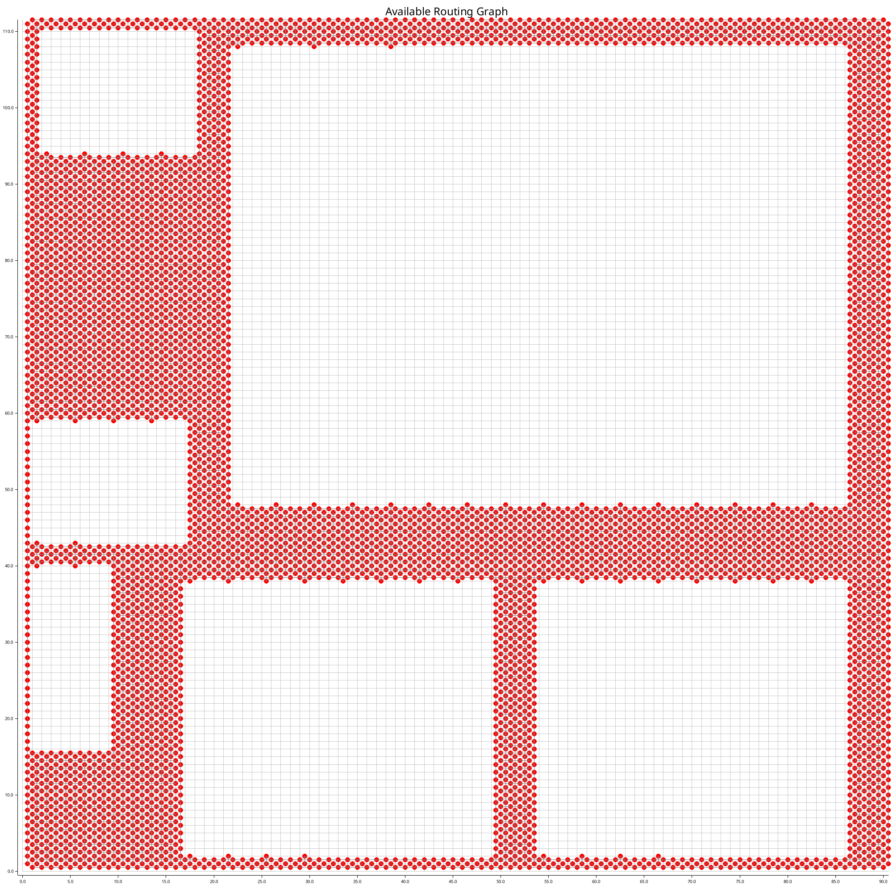
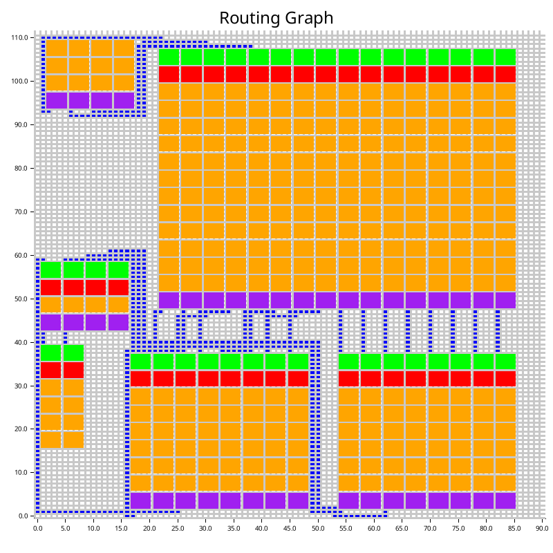

# Precise Route 

## Main concept 

In Design Space Exploration, there is a step where routing paths are assigned to connect nodes according to the edge information. However, it assigns the start and end locations of paths based on assumptions that 1) each edge uses only one communication wire, and 2) the start and end positions are located at the leftmost side of the input/output channels. These simplifications are addressed in the memory synthesis step by assigning the exact locations for memories and transporters and by providing the exact number of communication channels for every edge. For this reason, the previous routing paths can no longer be applied to the layouts after memory synthesis, and the wires must be rerouted.

The goal of this rerouting step is to assign routing paths for every edge from the correct output positions of the transporters of a start node to the correct input positions of the input buffers of a target node. Since the node fire times and the communication wire delays are determined during Design Space Exploration, this rerouting must produce paths whose lengths are as close as possible to the original routing paths, because the new paths need registers inserted to accommodate those fixed delays.

## Re-route process 
This step follows the same strategy used in [DSE-Route](./DSE-Route.md). It starts by creating an available routing graph and then using a path-finding algorithm to connect every required connection. The difference is that it uses information from the actual memory synthesis results to determine how many paths an edge needs, and from which positions to which positions these paths must be connected.

An example of the available routing graph is provided below. It may appear that the graph has not changed from the DSE-Route step, but if you look carefully at the input and output layers (the top and bottom of a node), you will notice that this reroute may add more available input and output ports, depending on the memory synthesis results. There may be cases where the available routing graph in this reroute step is the same as in the DSE-Route step, if the Alimp descriptions or the memory synthesis indicate that using one channel per edge is sufficient.

The order in which paths need to be determined is preserved based on traffic (defined by the number of token sizes), where the heavier-traffic connections are always routed before any lighter-traffic connections. Once a routing path has been decided, the tool removes the nodes used for that route from the available routing graph before routing the next connection.

### Path Finding Algorithm 

In the previous routing step, the A* algorithm is used to generate the shortest routing paths from start nodes to target nodes. However, the goal of this step is to route paths while keeping their lengths as close as possible to the original ones. Therefore, it uses a modified A* algorithm that adds a regularization term to penalize deviations from the desired length. The modified algorithm is shown below.

$$f(n)=g_{w}​(n)+h_{w}​(n)+λ⋅∣(g_{h}​(n)+h_{h}​(n))−L∣$$

Here, the first two terms remain the same:

1. $g_{w}​(n)$ is the cost of the path from the start node to $n$, and
2. $h_{w}​(n)$ is the estimated cost of reaching the target from $n$ using a heuristic function like Manhattan distance. 

The last term is the regularisation, where $λ$ is an adjustable parameter that controls how strongly the regularisation influences the cost function, and $L$ is the desired target length.

Below figure is the re-routing graph result of sobel example. 

