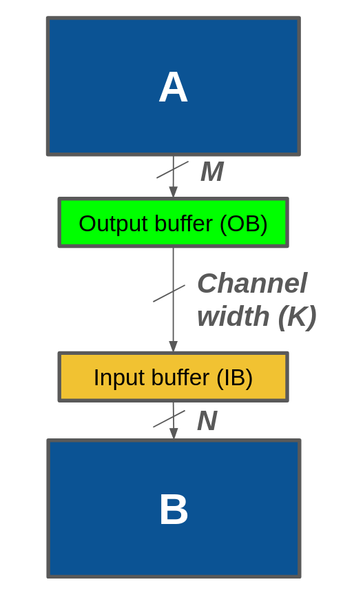
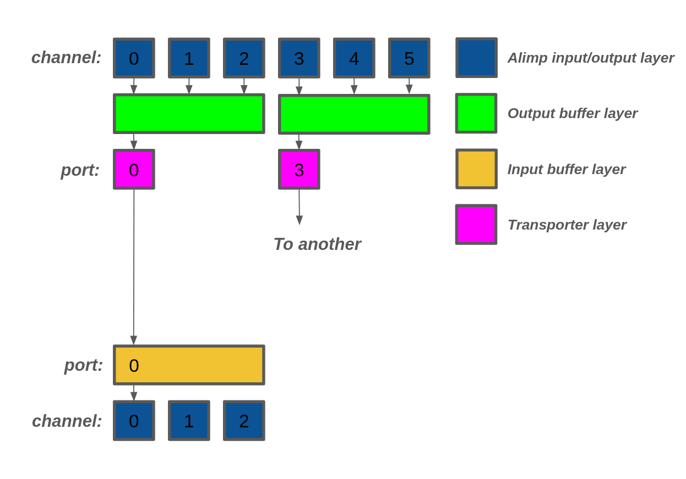
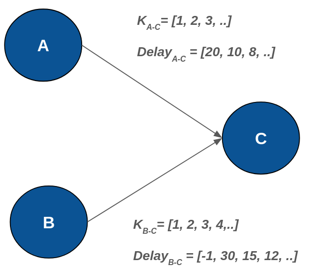
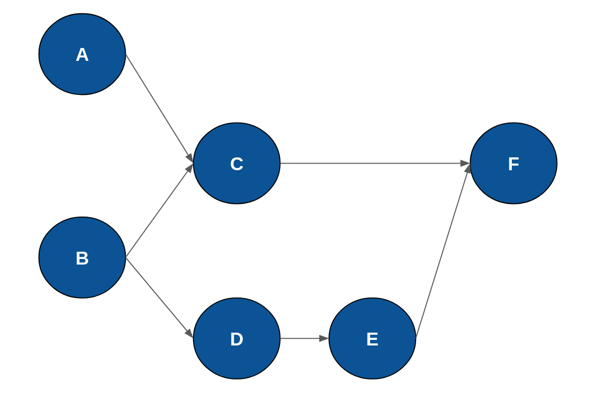

# GLIC Synthesis

The GLIC synthesis is the process of dimensioning the GLIC components and scheduling the SDF graph. Firstly, all components must be introduced:

1. Output buffer (OB) is a memory component attached to a node that sends data. The time required for the sending node to access this memory is architecturally assigned to one clock cycle.
2. Transporter (not shown in the image) can be seen as a sequencer that has a timing table of what and when to read the data from the output buffer and send it to the target. Physically, it is considered to be ideally next to the output buffer so that it can access the buffer without time delay.
3. Input buffer (IB) is a memory component attached to a node that receives the data. It has the same time requirement as the output buffer.
4. Communication channel is a routing path from the sending node to the receiving node, or more precisely, from the output of the transporter to the input of the input buffer. The time-delay parameter is already determined at this point, so it can be calculated when a data chuck from the OB will arrive at the IB. In this GLIC model, it is possible to allocate more than one communication channel to a connection because of the high bandwidth requirement, but it is assumed that all communication channels are put in the same routing wire and all data chucks are transported in that wire. This assumption, however, does not hold true in hardware, but it is kept this way and addressed in later stages of Sylva.   



The objectives of the GLIC process are to identify the following:

1. **Buffer Dimensioning**: This task is to identify the buffer sizes specifically in the Output buffer and the Input buffer.
2. **Channel Dimensioning**: This task is to dimension the NoC channels. We should synthesize low bandwidth channels for connecting channels as much as possible unless there is a need for high bandwidth channels.
3. **Scheduling**: This task is to schedule the SDF graph in data chunk level. This task should guarantee that each data chunk is produced before its consumption and the total latency and throughput are within the limits.


## Basic Concept

### Data Chunk

A data chunk is a sub-unit of data token. In SDF graphs, data tokens are the standard way to model the data that has been produced and consumed. But the data tokens are pure mathematical objects without any physical size limit. It could be as small as 1-bit or as large as 1TB. It does not make sense to directly map the data tokens to the physical system. We thus define the data chunk as the unit of data that need to be transported in the physical system.

Currently, we define a data chunk to be a **256-bit** packet. Any token has to be one or multiple of such data chunks. A property field `size` is attached to each token to indicate how many chunks it has.

### Buffer

Buffers in GLIC are idealized memory elements. It could have any number of read and write ports and each port can access any chunk stored in the buffer. The buffer size is also not limited.

Normally the SDF use FIFOs as memory elements and to resolve data dependencies. However, here we analyse the SDF in chunk level and we do not want to enforce the producer and consumer nodes to have exactly the same chunk address pattern. Therefore, a FIFO modelled data transfer channel is not always the best choice. The idealized memory model as buffers becomes easier to analyse and synthesise.

In later stages, the buffers will be synthesised to actual memory elements. However, depending on the specification of each buffer, the synthesis process may create FIFOs, Register Files or other types of memory elements.

### Data Transporter

The data transporter is a synthesised active device that transfer the data chunks from the output of one AlImp to the input of another AlImp. The data transporter is physically attached to the output port of the AlImp. The data transporter here is also a idealized model. It has no internal memory and can transport a certain number of data chunks in parallel where this number is determined by the GLIC synthesis process.

The transporter will be synthesised as a very simple processor-like device in later stages.

### NoC Channel

The NoC channel is the physical bandwidth of a connection between two AlImps. The NoC channel has one parameter, which is the delay time, and has one property - `bandwidth`. The bandwidth is the maximum number of data chunks that can be transported in parallel.

### Fire time

In SDF model, every node needs to be provided with when the node starts the execution. This information is so important as it relates to the address pattern below and also affects all decision varaibles we are going to solve. In this GLIC process, the clock-cycle-accurate fire times of the sending and receiving nodes must be determined, and after the scheduling, the fire times of transporters are also known. 

### Address Pattern

The address pattern is the pattern of the data chunks that are produced and consumed by the AlImps. The address pattern is a list of three integers that indicates the address of the data chunk, the cycle at which the data chunk is produced or consumed, and the channel from/to which the data chuck is sent or received. The address pattern is used to determine the data dependency between the AlImps and to schedule the SDF graph. For one edge connection, two data address patterns are to be dealt with since the sending node has one and the receiving has the other. In this step, the concept of channel is ignored because the buffers are ideal and is used only to determine the number of channels connected to the OB or IB (parameters `M` and `N` in the image), but it will come up in later stages.


### Channel 

This channel is not to be confused with the communication channel. Here, we use it to present the Alimp's cell positions where each data chunk is sent to the OB or received in the IB. The numbering is in order where the most left cell is assigned with position 0, the one to its right is assigned with position 1, and so on. In this GLIC process, all channels in one edge connection are connected to the only one ideal memory (either the OB or IB). Therefore, channels are used to identify the number of memory ports that access to the OB or IB.

### Port

In SDF graphs, there is no concept of port. However, we need to add the concept of port in order to model the I/O ports of the physical system. An edge in our SDF graph can only connect to a single input port and a single output port, and a port can only connect to a single edge. If there is a need to connect multiple edge to a single port, we need to modify the original SDF by inserting **split** nodes or **merge** nodes.





## Solve the problem

As you might have noticed, this problem has several objectives, some of which require are lists of long sequence. This makes the problem difficult to be solved in one go, so we decided to partition the problem into 2 - 3 steps as followings

- Determine the communication channel size
- Determine the buffer sizes and schedules.

### Dimension the channels

The information that would have so much impact on the communication channels is the fire time of the nodes and the input and output address patterns. 

First, we store the execution time of every node in `EXECUTION_TIME` and define a list of `fire_time`, which means the time that each node starts its job, and a list of `end_time`, which is the time of each node to finish the job. We can link the relation between the start and end time and can intuitively assign nodes without predecessors to start at time 0 as shown in the constraints below. Please note that `N` is the number of nodes in the applicaiton.

```
constraint forall(i in 1..N)(\
	end_time[i] = fire_time[i] + EXECUTION_TIME[i]\
);

constraint 0 = min([fire_time[i] | i in 1..N]);
```

To properly assign the fire times for nodes that have predecessors, it is inevitable to deal with input and output patterns because they determine how many clock cycles after the sending node starts the receiving node can start, also depending on the communication channel size. This problem becomes even more complex if a node has more than one predecessor. However, the problem can be reduced if we consider only Pareto points to obtain lists of communication-channel sizes and time delays, as shown in the figure below.

What we have to do to obtain a list of time delays will be described later. The benefit of having these lists is that we can easily know, for example, that if the channel width from A to C is 1 the time delay is 20 clock cycles, or that a channel width of 1 is not possible for edge B to C.



Now that we have lists `K_OF_{edge}` and `MIN_DELAY_OF_{edge}` where `{edge}` is an edge name, we can add the following constraints.

```
% decision variables
var 1..{}: selected_edge_{};
var int: k_{};
var int: min_delay_{};

constraint k_{} = K_OF_{}[selected_edge_{edge}];
constraint min_delay_{} = MIN_DELAY_OF_{}[selected_edge_{}];
constraint fire_time[{}] + min_delay_{} < fire_time[{}];
```  

Finally, the objective of this problem is to minimise the number of communication channels and delay time. We can reduce the two-objective goal into one problem as the following

```
solve minimize (sum_of_min_delay + {HYPER_PARAMETER} * sum_of_k);
```
 
The results of this step are a list of `k_{}`. 
 
#### Determine the delay time

To get a list of delay time provided the communication channel size, we also need the output and input patterns. Additionally, we have a quick heuristic algorithm to skip solving some parameter K values that are too narrow for a given problem or too large to speed up the compute time.

In this problem, we have a list of output patterns `src_patterns` and a list of input patterns `dst_patterns`, which are all defined integers by the provided HLS library. Additionally, a list of sorted `dst_patterns` is also determined and fed to this constraint solver as `sorted_dst_indices`. 

```
var 2..MAX_DELAY: delay;
array [1..N] of var 0..MAX_DELAY: tr_read;
```

This first variable is what we would like to figure out and the second is a necessary decision variable that tells the output time sequence from the OB to IB. Now, add the first constraint to mimic the behaviour between the OB and IB determined by patterns, add the second constraint to model the channel size, and finally add the third constraint to guild the pattern of `tr_read` to push the pressure on the OB.

```
constraint forall(i in 1..N)(
	tr_read[i] > src_patterns[i] /\
	dst_patterns[i] + delay > tr_read[i] /\
	dst_patterns[i] + delay < MAX_DELAY
);

constraint cumulative(
	[tr_read[i] | i in 1..N],
	[1 | i in 1..N],
	[1 | i in 1..N],
	WIDTH
);

constraint forall(k in 1..N-1)(
	tr_read[sorted_dst_indices[k]] <= tr_read[sorted_dst_indices[k+1]]
);
```

The objective of this sub problem is to minimise the variable `delay` and if the solution is feasible, the delay value will be returned and combined into a list of delay in the main channel demensioning problem. 


### Dimension the buffers and scheduling

From previous analysis, we know the channel dimension for each edge, but solving for buffer sizes and schedules simultaneously requires a lot of time and resources. Therefore, we partition the problem and solve it for each edge and node individually. The order in which we solve depends on the topology of the given SDF graph: nodes with no successors are simply assigned fire times of zero; nodes at the next level are solved afterward, and so on until the final level.

For example, in the application shown in the figure below, A and B are assigned start times of zero. To solve for C, we must consider both the A–C and B–C edges. D can be solved at the same time as C. E must be solved before F because E has a dependency on F.




There are some important (decision) variables that have to be determined for each solve.

1. `OB`: The output buffer size which can be any non-negative integer.
2. `IB`: The input buffer size which can be any non-negative integer.
3. `T0`: A list of time sequences when a chunk is produced by the sending node and written to the output buffer, provided as fixed integers.
4. `T1`: A list of time sequences when a chunk is read by the transporter and sent to the communication channel(s).
5. `T2`: A list of time sequences when a chunk arrives at the input buffer of the receiving node.
6. `T3`: A list of time sequences when a chunk is read by the receiving node from the input buffer, provided as fixed integers.
7. `D01`: A list of times spent in the output buffer for each data chunk - essentially `T1-T0`.
8. `D23`: A list of times spent in the input buffer for each data chunk - essentially `T3-T2`.
9. `WIRE_DELAY`: A defined delay time in clock unit which relates the variables `T1` and `T2`. 

The goal of this step is to determine three variables - `OB`, `IB`, and `T1`. If all solves are finished, we can then pack all lists of these three variables together, and hence, we satisfy the objective of dimensioning buffer sizes and scheduling.

#### Each solve at a node

We needs to take into account all the predecessors to this current node. For each predecessor shared an edge connection, we have lists of patterns, `source_addr_time` and `target_addr_time`, and the sorted address pattterns, `sorted_target_time`, like before.

```
constraint fire_time >= SOURCE_FIRE_TIME_{} + TOTAL_DELAY_{};

constraint forall(i in 1..TOKEN_SIZE_{})(
	T0_{}[i] = SOURCE_FIRE_TIME_{} + source_addr_time_{}[i] /\
	T2_{}[i] = T1_{}[i] + WIRE_DELAY_{} /\
	T3_{}[i] = fire_time + target_addr_time_{}[i] /\
	D01_{}[i] = T1_{}[i] - T0_{}[i] /\
	D23_{}[i] = T3_{}[i] - T2_{}[i]
);

constraint forall(k in 1..TOKEN_SIZE_{}-1)(
	T1_{}[sorted_target_time_{}[k]] <= T1_{}[sorted_target_time_{}[k+1]]
);

constraint cumulative(
	[T1_{}[i] | i in 1..TOKEN_SIZE_{}],"
	[1 | i in 1..TOKEN_SIZE_{}],
	[1 | i in 1..TOKEN_SIZE_{}],
 	K_{},
);

constraint cumulative(
	[T0_{}[i] | i in 1..TOKEN_SIZE_{}],"
	[D01_{}[i] | i in 1..TOKEN_SIZE_{}],
	[1 | i in 1..TOKEN_SIZE_{}],
 	OB_{},
);

constraint cumulative(
	[T2_{}[i] | i in 1..TOKEN_SIZE_{}],"
	[D23_{}[i] | i in 1..TOKEN_SIZE_{}],
	[1 | i in 1..TOKEN_SIZE_{}],
 	IB_{},
);
```

The above constraints model the GLIC behaviour, where `{}` is to be replaced with an edge name connected to a predecessor. Here is an explanation of what each constraint does:

1. Modeling the current `fire_time` using the information about the start time and execution time of its predecessor.
2. Modeling the lists of time sequences defined earlier. 
3. Pushing the pressure to the OB side to give some ordered list.
4. Modeling the communication channel with a fixed size.
5. Modeling the output buffer size.
6. Modeling the input buffer size.

Finally, we minimise the objective function so that the model produces a final result with minimal buffer sizes.


```
constraint BUFFER_SIZE = sum([OB_ALL]) + sum([IB_ALL]);
solve minimize BUFFER_SIZE;
```


## Address Assignment Process

The address assignment process translates the global address pattern, which is used by each AlImp to the input buffer and output buffer address pattern. The address assignment process used in the GLIC synthesis is a simple equitable address assignment process. It basically evenly distribute the address assignment as much as possible. In later process, the address assignment will be adjust by applying more realistic address assignemnt process.
