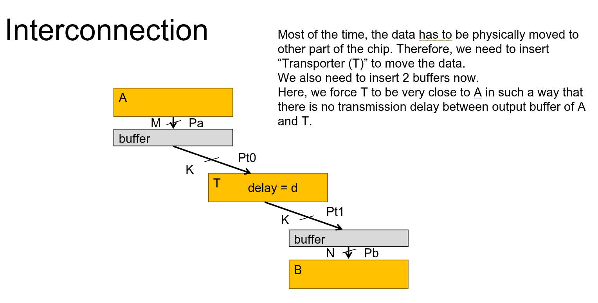

# GLIC Synthesis

The GLIC synthesis is the process to dimension the GLIC components and schedule the SDF graph. There are three tasks in this process:

1. **Buffer Dimensioning**: This task is to size the buffers in the GLIC components. The buffers implement the input and output buffers of the AlImps.
2. **Channel Dimensioning**: This task is to dimension the NoC channels. We should synthesize low bandwidth channels for connecting channels as much as possible unless there is a need for high bandwidth channels.
3. **Scheduling**: This task is to schedule the SDF graph in data chunk level. This task should guarantee that each data chunk is produced before its consumption and the total latency and throughput are within the limits.

## Basic Concept

### Data Chunk

A data chunk is a subunit of data token. In SDF graphs, data tokens are the standard way to model the data that is been produced and consumed. But the data tokens are pure mathematical objects without any physical size limit. It could be as small as 1-bit or as large as 1TB. It does not make sense to directly map the data tokens to the physical system. We thus define the data chunk as the unit of data that need to be transported in the physical system.

Currently, we define a data chunk to be a **256-bit** packet. Any token has to be one or multiple of such data chunks. A property field `size` is attached to each token to indicate how many chunks it has.

### Port

In SDF graphs, there is no concept of port. However, we need to add the concept of port in order to model the I/O ports of the physical system. An edge in our SDF graph can only connect to a single input port and a single output port. And a port can only connect to a single edge. If there is a need to connect multiple edge to a single port, we need to modify the original SDF by inserting **split** nodes or **merge** nodes.

### Buffer

Buffers in GLIC are idealized memory elements. It could have any number of read and write ports and each port can access any chunk stored in the buffer. The buffer size is also not limited.

Normally the SDF use FIFOs as memory elements and to resolve data dependencies. However, here we analyze the SDF in chunk level and we do not want to enforce the producer and consumer nodes to have exactly the same chunk address pattern. Therefore, a FIFO modelled data transfer channel is not always the best choice. The idealized memory model as buffers becomes easier to analyze and synthesize.

In later stages, the buffers will be synthesized to actual memory elements. However, depending on the specification of each buffer, the synthesis process may create FIFOs, Register Files or other types of memory elements.

### Data Transporter

The data transporter is a synthesized active device that transfer the data chunks from the output of one AlImp to the input of another AlImp. The data transporter is physically attached to the output port of the AlImp. The data transporter here is also a idealized model. It has no internal memory and can transport N data chunks in parallel where N is determined by the GLIC synthesis process.

The transporter will be synthesized as a very simple processor-like device in later stages.

### NoC Channel

The NoC channel is the physical bandwidth of a connection between two AlImps. The NoC channel has one property: `bandwidth`. The bandwidth is the maximum number of data chunks that can be transported in parallel.

### Address Pattern

The address pattern is the pattern of the data chunks that are produced and consumed by the AlImps. The address pattern is a list of integers pairs that indicates the address of the data chunk and the cycle when the data chunk is produced or consumed. The address pattern is used to determine the data dependency between the AlImps and to schedule the SDF graph.

## NoC Channel Model

.

## Objectives

1. Schedule everything so that the computation is correct.​
2. Minimize latency.​
3. Minimize the buffer size.​
4. Minimize the bandwidth of data transfer path.​

## Channel Dimensioning Process

`F` is the fire vector of the SDF graph. `F[i][j]` means the fire time of node `i` in the `j`-th repetition.

`END_TIME` marks the end of the execution of each node. So, we post the following constraints:

```
END_TIME[i] == F[i][MAX_REPETITION_i - 1] + DURATION[i]
```

We also treat transporter as a node. So, the fire time of the transporter is also in `F`.

For each edge, we do the following:

1. Find the maximum channel bandwidth (`max_channel_width`) by simply take the maximum of the degree of parallelism of input address pattern and the output address pattern.
2. Create `K_VARS` variable for each edge ranging from `0` to `max_channel_width`.
3. Create `K_VECS` variable as the boolean expansion of `K_VARS` by posting the following constraints:

   ```
   K_VARS[i] == k iff. K_VECS[i][k] == 1
   sum(K_VECS[i]) == 1
   ```

4. Find the minimal delay between the producer and consumer nodes by analyzing the address pattern of the producer and consumer nodes and the current channel width `x`. We call the minimal delay `MIN_DELAY_x`.
5. Post a constraint to enforce the firing order of the producer node `i` and the consumer node `j` at the `x`-th repetition:
   ```
   F[i][x] + MIN_DELAY_x <= F[j][x] iff. K_VECS[i][x] == 1
   ```
6. Post the objective function:
   ```
   obj = sum(K_VARS[i]*WORKLOAD[i])
   ```
7. Minimize the objective function.

## Buffer Dimensioning Process

From previous analysis, we know the channel dimension for each edge. We can now calculate the buffer size of each communication channel.

We do the same and create variables `F` and `END_TIME`.

For each edge, we make an variable `OB` and `IB` to represent the output buffer and input buffer size of the edge.

For each edge, we create the following variables:

1. `T0`: The time when a chunk is produced by the producer node and write to the output buffer.
2. `T1`: The time when a chunk is read by the transporter and send to the NoC.
3. `T2`: The time when a chunk transported to the input buffer of the consumer node.
4. `T3`: The time when a chunk is read by the consumer node from the input buffer.
5. `TR`: The fire time of the transporter.
6. `D01`: The delay between the producer node and the transporter.
7. `D23`: The delay between the input buffer and the consumer node.

Then, two interval can be created:

1. `INTERVAL0`: The interval between `T0` and `T1`.
2. `INTERVAL1`: The interval between `T2` and `T3`.

Then, we post the accumulative bound constraints for the two intervals, so that in any time `t`, the number of chunks in the output buffer and input buffer are less than the size of the buffer. The constraints are as follows:

```
cumulative_bound(INTERVAL0, [1], OB)
cumulative_bound(INTERVAL1, [1], IB)
```

Then, we constraint the channel bandwidth. In any time `t`, the number of chunks that is read from the output buffer cannot be larger than the channel bandwidth. The constraints are as follows:

```
INTERVAL2: [T1, T1+1]
cumulative_bound(INTERVAL2, [1], K)
```

Then, we post the objective function:

```
obj = sum(OB)+sum(IB)
```

Finally, we minimize the objective function.

## Address Assignment Process

The address assignment process translate the global address pattern which is used by each AlImp to the input buffer and output buffer address pattern. The address assignment process used in the GLIC synthesis is a simple equitable address assignment process. It basically evenly distribute the address assignment as much as possible. In later process, the address assignment will be adjust by applying more realistic address assignemnt process.
