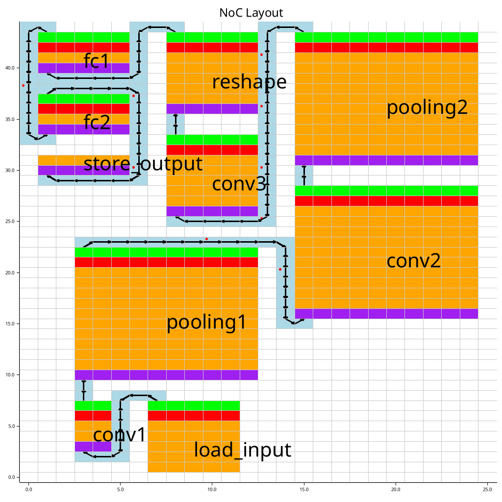

# NoC Wire Synthesis

This process is to synthesize the path created by the routing process using more realistic wire-like components. There are three types of components that are used in the synthesis process. They are:

- Wire
- Buffered Wire
- Registered Wire

Why do we need these components in our solution? It is because we have to satisfy the timing requirements of a routing path from node A to node B. These requirements are the final slew to the input of B and the total delay time from A to B. If a routing path does not meet these requirements, which is often the case with a long path, it is required to be fixed by either putting buffered wires or registered wires, or both.

It is important to run this step before the scheduling process because the scheduling process requires the latency of each communication path in terms of clock cycles.

## Wire Synthesis

The NoC wire synthesis can be done without constraint programming because the objectives are clear and a simple heuristic method already gives a solution with a low cost. The cost in this case is how many wire-like components we are putting in a path. The lowest one is of course wire, followed by buffered wire, and lastly registered wire. We assume that it is not relevant how many buffered wires you put in, one registered wire always costs more. This simplifies our problem, and only a simple heuristic method is needed.

The direction to which the path goes and the interference from nearby nodes and other wires are not taken into account for inserting wire-like components, only the length of wire is. To decide which positions buffers and registers are placed, we pass the length of a routing path and the technology constraint to the algorithm.

### Path Satisfaction

Before we look at how we put registers and buffers, we need to be able to tell if a routing path satisfies the constraints or not. This process  checks if a pure wire or wire with buffers meets the requirements.

It first locates buffer positions and splits the wire into many segments according to those positions. For example, we have one segment if the number of buffers is zero, and two segments if the number of buffers is one. Next, for each segment, the process determines its delay time by using the slew rate and the table in the technology constraint. Passing through a buffer improve the delay time, but decreases the slew rate. Finally, the total delay time and final slew rate are calculated and checked if they meet the requirements.

If this fails, putting more expensive components is needed to fix the timing. However, the best solution with the lowest cost is a pure wire without a buffer or register.

### Buffer Insertion

Based on a given length of wire, this process explores the lowest cost of putting more buffers to satisfy the requirements.

Firstly, it checks the given wire without putting a buffer. If it does not satisfy, the process puts a buffer in the middle of the wire. If this also fails, we remove the buffer and add two buffers in equal distance that is one in the one-third and the other in the two-third. It keeps checking and replacing buffers in a balancing way possible until the solution satisfies.

If we put buffers to the point where we have one buffer and one wire repeatedly and still fail, we will stop this process and change the strategy to put registers instead.

### Register Insertion

Since placing a register to the middle of wire means the timing path splits into two, it relaxes the constraints massively. This is because the left wire needs to meet the timing constraint to only the register point, and the right one starts from the register point.

The process of adding registers is nothing different from putting buffers. First it places a register in the middle. Now, The two chunks are considered separately. The left chunk uses the buffer insertion function to add buffers and check its own timing constraints, and similar for the right one. If one of them fails, all components are removed and two registers are placed at an equal distance. More registers will be added until a solution is found.

If the register insertion still cannot fix the timing constraint, this means that the constraints are too tight.

## Example

