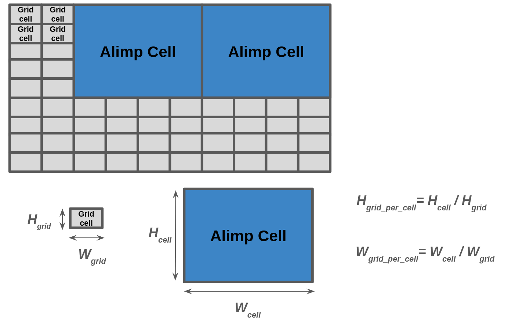
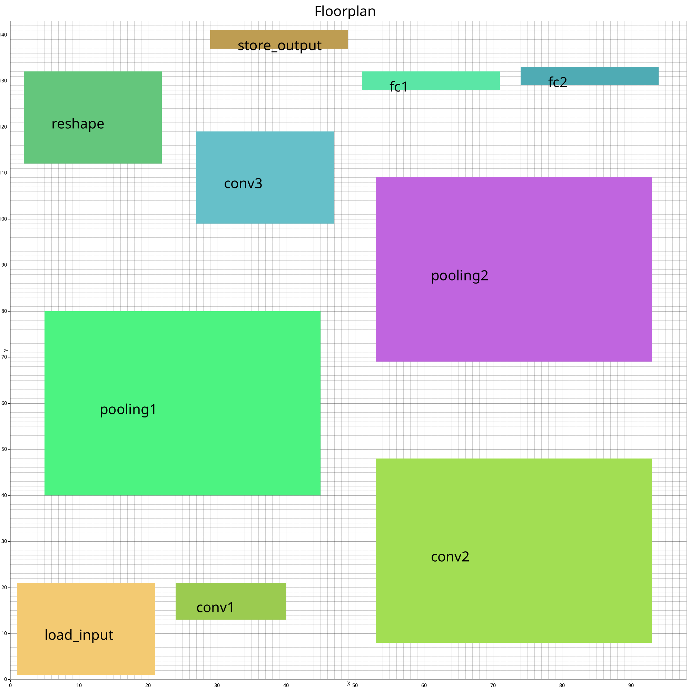

# Placement Process

## Main concept

The placement process takes one of the binding solutions and tries to place the alimps on a canvas in a 2D grid system. It must consider all the global constraints, reserve space for routing, and minimize the communication cost. 

First, the components used in Application-Level Synthesis need to be introduced:

- An Alimp cell is used to compose a node (or an algorithm, in the context of HLS).
- A method for transferring data between nodes is required, so cells for output buffer and input buffer are placed at the top and bottom of each node that needs input or output.
- A layer of transporters is placed on top of the output buffer as a way to transport data tokens sending from this node to another. 
- All other cells are considered grid cells, which are used as NoC routing cells and buffered-region cells (a later optimisation step).


One important idea behind these extra cells is that input and output layers are added only when an HLS library indicates that a node needs to receive a sequence of inputs or send a sequence of outputs. When a node has no input, the input buffer layer is omitted, and the same applies for the output buffer and transporters, since both relate to output.

ALS treats cells that compose an algorithm and cells used for input/output buffers and transporters as having the same dimensions. A block of those cells is simply called a "cell". Other cells, such as routing cells, are celled "grid" cells. In general, a cell is larger than a grid cell in both width and height, since it often contains registers, memory, and compute resources, while a grid cell is used for routing wires or holding a small number of registers. Because of this, width and height ratios are introduced to indicate how many grid cells make up one cell. These ratios are restricted to integers to keep the search space manageable. 





## Preprocessing

First, we simplify the floorplanning problem by using only one grid size instead of two. Every width and height measured in ``cell`` units is converted into ``grid`` units by multiplying with the corresponding factor, either ``height_grids_per_cell`` or ``width_grids_per_cell``. After this conversion, the problem becomes simpler because everything is expressed within a single 2D grid system.

Before starting the placement, we also enlarge the alimp area at the top and bottom to include input/output layers and transporters if the alimp requires input or output. In addition, artificial area around the entire alimp block, including input/output buffer and transporters, must be reserved to some extend for the purpose of routing availability. This reserved space extends above and below the block, as well as to the sides. The size of this artificial area depends on the number of input/output channels* of the alimp and a hyperparameter.

*The input and output channel in this context refer to the number of alimp cells used to send or receive data to or from the output and input buffer layers.


Similar to the binding process, the placement process is performed in two steps: optimal placement and approximate optimal placement.

## Optimal Placement

### Original Decision Variables

`x` and `y` are the original decision variables that contain the starting coordinates of the alimps. Each node has its own `x` and `y` positions. Additionally, we have a variable named `N` to represent the total number of nodes in this application.

### Derived Decision Variables and Constraints

First we set the maximum width and height, and we create a set of constraints to make sure that 1) each node fits inside the allowed area, and 2) there is no overlapping between any two nodes, which form an optimization problem of bin-packing.

```
MAX_WIDTH = global_constraint.max_width;
MAX_HEIGHT = global_constraint.max_height;

constraint forall(i in 1..N)(
    x[i] + widths[i] <= MAX_WIDTH /\
    y[i] + heights[i] <= MAX_HEIGHT
);

constraint forall(i, j in 1..N where i < j)(
  (x[i] + widths[i] <= x[j] \/ x[j] + widths[j] <= x[i]) \/
  (y[i] + heights[i] <= y[j] \/ y[j] + heights[j] <= y[i])
);
```

Where widths and heights are lists of selected alimp for each node with respect to index i/j.

Then, we define the `max_x_position` and `max_y_position` decision variables to represent the maximum x and y coordinates of the alimps by posting the following constraints:

```
constraint forall(i in 1..N)(
  x[i] + widths[i] <= max_x_position /\
  y[i] + heights[i] <= max_y_position
);
```

We also force the floor plan after placement to be a more square-like shape. We require that the width cannot be larger than twice the height and vice versa. This is done by posting the following constraints:

```
constraint max_x_position * 2 >= max_y_position;
constraint max_x_position <= max_y_position * 2;
```

We would like also to fix the first node to be placed at the bottom-left corner. This requires the following constraints:

```
constraint x[1] < ((MAX_WIDTH + 1) div 2);
constraint y[1] < ((MAX_HEIGHT + 1) div 2);
```

The total area should be less than the max_area specified by the global constraints. This is done by posting the following constraint:

```
constraint max_x_position * max_y_position <= MAX_WIDTH * MAX_HEIGHT;
```

### Objective Function

The objective function is to minimize the total area of the floor plan. This is done by posting the following constraint:

```
solve minimize (max_x_position * max_y_position);
```

## Approximate Optimal Placement

The approximate optimal placement takes the `max_x_position` and `max_y_position` decision variables from the optimal placement and relaxes the constraints by extending the maximum width and height variables as follows

```
MAX_WIDTH <= old_max_x_position * relaxation_factor
MAX_HEIGHT <= old_max_y_position * relaxation_factor
```

We then post all the constraints similar to the optimal placement process with some additional constraints described below, but there is an additional consideration point that we need to evaluate to be able to factor in the cost of wire length.

First, we calculate x and y positions for each edge source and target. We then compute the distance matrix between all the connected alimps by computing their manhattan distances of their input/output port positions. Lastly, we compute the weighted distance matrix by multiplying the distance matrix with the connectivity factor of each connection.

```
constraint forall(i in 1..E)(
  dx[i] = abs(source_x[i] - target_x[i]) /\
  dy[i] = abs(source_y[i] - target_y[i]) /\
  distance_matrix[i] = dx[i] + dy[i] /\
  weighted_distance[i] = edge_conns[i] * distance_matrix[i]
);
```

What this set of constraints does is ensure that if we minimize the `weighted_distance` matrix, the alimps will be placed so that the connection length from one to another is short.

### Objective Function

Then, we minimise the total weighted distance of all the connections and also the total area by posting the following constraint where hyper parameters are adjustable:

```
solve minimize (hyper_distance_weight * sum(weighted_distance) + (hyper_area_weight * max_x_position * max_y_position));
```

## Example

A floorplan example of lenet5 is presented in the 2D grid system below. Please note that this graph exclude some extra layers of every node - input buffers, output buffers, and transporters.

