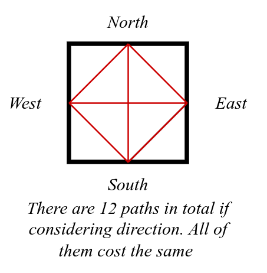
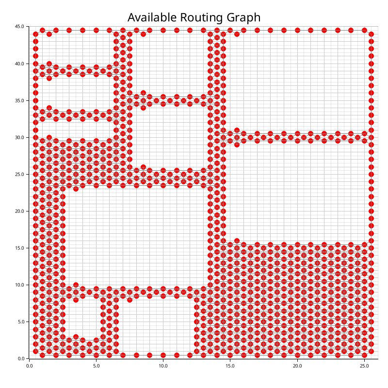

# Routing Process

## Create Routing Graph

A routing graph is a representation graph of all possible routing path for a given design. each cell could have 4 possible routing terminals. They are east, west, north and south. Every terminal could be connected to every other terminals. To simplify the problem we consider all paths inside one cell have the same cost. See the followin figure:

A routing graph is built by following the steps below:

1. Create a fully connected routing graph according to the width and height of the design.
2. For each placed alimp, remove the routing path that is inside the alimp area. This is equivalent to adding an alimp-shaped obstacle to the routing graph.
3. For each placed alimp peripheral, remove the routing path that is not used as input/output ports.

An example routing graph is shown below:

## Path Finding Algorithm

We use the A* algorithm to find the shortest path between two terminals. The A* algorithm is a graph traversal and pathfinding algorithm that is used to find the shortest path between two nodes in a graph. The A* algorithm uses a heuristic function to estimate the cost of the path from the current node to the goal node. The A* algorithm is guaranteed to find the shortest path if the heuristic function is admissible, meaning that it never overestimates the cost of the path. The heuristic function we use is the Manhattan distance between the current node and the goal node.

## Routing Order

We use a greedy algorithm to find the best routing path for each connection, however, we order the routing path according to the traffic (workload) of the connections. The heaviest traffic connection is routed first. The traffic of a connection is defined as token size.

Once a path is routed, we remove the path segments occupied by the routed path from the routing graph.

## Example

The following figure shows the routing graph after routing the connections:

