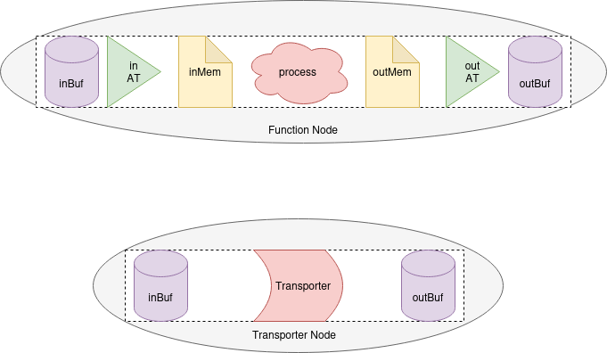
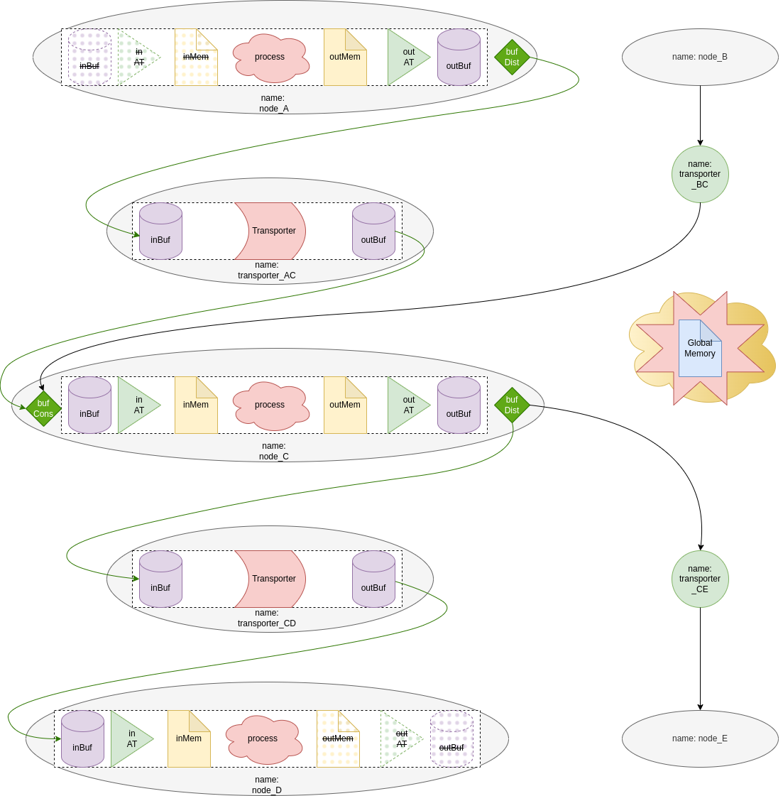

# Simulation

In this simulation, there is a need for two main components: the Scheduling Information Generator and the GLIC Simulator. Although the two are parts of the compilation process, both of them are not directly connected. They share information through JSON files.

The Scheduling Information Generator is a process run after the GLIC Synthesis. This is because it produces scheduling information of all nodes in the graph. This information includes when a node or a transporter is fired, how many tokens does a node consume and produce, what is the functionality of each node, how nodes are connected, and address translation tables. All of these are written down as JSON files in a specific directory in this project. The simulator will later read these files and run the actual simulation.

The simulator is a simulation of **Global Interconnect** (GLIC) which has a sequential flow of control. This work is originally from [GLICsim](https://github.com/drakeKG/GLICsim) by Kushagr Gautam. It uses those generated files and runs the ideal simulation. To put it simple, it starts executing the nodes according to their fire times, moves the data those nodes generated, and runs all the other nodes until there is node left to run. The simlator handles the flow of data by writing and reading JSON files (despite the fact that the simulator accepts both JSON and binary files). The contents of the files are standardised using Google's Protocol Buffers v3 (ProtoBuf).

## Scheduling Information Generator

Why do we need this process since we already know everything required for the simulation in the program already? It is because we want the simulation part to be as independent to the main compilation as possible. That is why we standardised information needed for the simulation in JSON format and stored it in files.

This process is handled by ``modules/src/sim/mod.rs``. It creates 5 types of file in this specific directory ``{output}/sim``, the actual number of files generated could be many more. Additionally, it copies two memory files: the global memory image and global memory reference to ``{output}/sim/mem``. It is worth mentioning it again that all of them are JSON files. If you want to know more about the data structure of each type of files, please find them in ``modules/sv-lib/src/sim.rs``. We will go through each type in this section.

This is a template file structure in ``{output}/sim/`` directory. For config_map.json, time_table.json, and two memory files, there is only each one of them, but for others there can be more depending on how many nodes and transporters we have in the application.

```
├── config_map.json
├── time_table.json
├── {node_id}_inAP.json
├── {node_id}_inTT.json
├── {node_id}_outAP.json
├── {node_id}_outTT.json
├── {transporter_id}_TransInst.json
└── mem
    ├── global_mem_image.json
    └── global_mem_reference.json
```

Note: {output} is a directory where you specify in running sylva application, specifically in ``--output`` argument.

### Configuration file

This file contains a list of all nodes and edges (or often called transporters) in the graph. For each one, it has many fields to descript how they are connected or what they do, as shown in the following.

1. ``is_transporter``: A boolean value to indicate if this is a node or a transporter.
2. ``in_names``: A list containing input edges to this node.
3. ``out_names``: A list containing output edges from this node.
4. ``process_cmd``: A valid command to run the executable that represents the functionality of a node. (More details about this are in the Simulator)

### Time Table file

This file tells the simulator which exact cycle it has to schedule the node or the transporter.

### Address Pattern files

These files describes the input and output behaviour of a node. Each node has two files describing input address patterns and output address patterns, except some nodes that have only input or output patterns if those nodes are end nodes or start nodes, respectively. For input address patterns, we named those file in this convention: `{node_id}_inAP.json` where `node_id` is the node name. Similarly for output address patterns, they have the name convention like this: `{node_id}_outAP.json`.

In a file, it contains a long list of address patterns where each element has two fields:

1. ``address``: address to the node memory.
2. ``cycle``: the time at which the data to this address has to be sent out or written depending on the direction.

In general, the list starts with address 0, followed by 1, 2, 3 up to the last address. To depict what does an input address pattern do, for example if we have en element containing address 4 at cycle 10, this node gets the input data to address 4 after the node fires 10 cycles.

It is important to note that the synthesis tool does not randomly generate this information. It simply forwards the data from the Alimp information provided by the user.

### Translation Table files

Similar to the address pattern files, they must have two sides - one for input edges and the other for output edges. For a start node, it has only an output translation table file, and vice versa for an end node. Since the capacity of transporters is likely much lower than the size of a node memory, it is required to translate memory addresses of a sending node to physical addresses of the communication channel before they are sent over, and after that, translate them back to be memory addresses of a receiving node.

In a file, it contains a long list of mapping addresses where each element has two fields:

1. ``addr_in``: An address to a node memory
2. ``addr_out``: for sending nodes, a link address to send the data in ``addr_in`` to, and for receiving nodes, a link address at which the data should be written to ``addr_in``

By looking at the addres pattern files, we know when to send/receive an address, and with the provided translation tables, we know which physical address of the communication channel to be used.

### Transporter Instructions files

For a transporter to be able to transfer data in a correct order, it requires to know the time and where should it read and write the data to. In other words, these instructions tell the transporters that at which cycle, they need to read the sending buffer at one address and send the data to the receiving buffer at another address. This is done by having a list of transport instructions where each instruction has three fields:

1. ``cycle``: the time to transfer the data over the communication channel.
2. ``addr_rd``: a read address of the sending buffer (of a send node).
3. ``addr_wr``: a write address of the receiving buffer (of a receive node).

### Global Memory Image

This file is provided by user as an initial memory image to be used by the simulation. This process just copies the file to this location ``{output}/sim/mem/global_mem_image.json``.

The file will be used by the simulation. Nodes that interact with the global memory will read or modify this file.

### Global Memory Reference

This file is provided by user as a correct final result of the memory image after running the simulation. This process just copies the file to this location ``{output}/sim/mem/global_mem_reference.json``.

After the simulation, this file is compared with the global memory image to verify that the simulated application procedues results correctly.

## GLIC Simulator

The simulator works on two simplified concepts: the transporters have only one input and one output, and it knows all dependencies of the whole graph. With these ideas, the simulator can 1) schedule every node and transporter according to the flow diagram from start to end, 2) store the output memory of a node/transporter after being fired, and 3) feed the whole memory file as input to the node/transporter because there exists translation tables and instructions to make sure there will be no collision in transferring data.

Similar to the first part, the simulator also uses JSON files as communication objects between nodes and transporters. We first introduced directory structure and what types of file we use in the simulation, and then describe components required to simulate a node and transporter and how are they connected.

Note: the source code of this simulator can be found at ``modules/sv-sim/``, and we use the same library and base modules in ``modules/sv-lib/`` as we do with sylva application.

### Directory and Files

#### Directory Structure

The source directory **modules/sv-sim/src** contains the implementations for

```
├── command_runner.rs
├── main.rs
├── node.rs
├── process_module.rs
└── transporter_module.rs
```

The working directory **{output}/sim/** has a structure as shown below. Other files except inBuf, inMem, outBuf, and outMem are already mentioned in the first part of this document. For those four types of file, we will go into details  in the next section.

```
├── config_map.json
├── time_table.json
├── {node_id}_inAP.json
├── {node_id}_inTT.json
├── {node_id}_outAP.json
├── {node_id}_outTT.json
├── {transporter_id}_TransInst.json
└── mem
    ├── global_mem_image.json
    ├── global_mem_reference.json
    ├── {node}_inBuf.json
    ├── {node}_inMem.json
    ├── {node}_outBuf.json
    └── {node}_outMem.json
```

#### Memory Buffers vs Memory Image

Memory image files and memory buffer files are used to communicate between different modules in a node, and between two nodes.

1. A _Memory Image File_ is a regular memory file containing information about memory address and the value held in them without time information indicated. Generally, this type of file is used by a process node as an input and output image to represent functionalities of a node to its input data (input image) by storing the result in the output image.

2. A _Memory Buffer File_ is a record of values changed in various physical (link) addresses accompanied by the cycleTime at which the memory was altered. This type of file is used by both a process node and a transporter node to transfer data from one place to another using timestamps and addresses. The addresses refer to the place in the communication channel they belong to, and the timestamps are the time at which they have the interactions with the channel. The type of interactions depends on the process and the direction. An example of transferring data from node A to node B with a transporter T is illustrated below.

    1. A_outBuf.json: The time when the data is placed in the output buffer of a processing node.
    2. T_inBuf.json: Same as above.
    3. T_outBuf.json: The time when the data is sent over the communication channel.
    4. B_inBuf.json: Same as above.

### GLIC Components and Connection

The Parent module in this simulator is called a **node** [Implemented in node.py]. A _node_ can be configured to be a **function node** or a **transporter**. Nodes are identified using _node names_ (string type). Name is used as key in the **time-table** [structure defined in _glic_config.proto_] to trigger the operation of the node.



A function node contains a _process module_, and may contain one or two **address translators (AT)**, namely:

- input address translator
- output address translator

Usually the entry nodes (node A in [Figure 2](#figure-2)) on a flow graph will not have an input AT whereas, the exit nodes (node D in [Figure 2](#figure-2)) will not have an output AT.

{#figure-2}

#### Process module

The process module reads the input image (or the global memory image), runs its functionality, and writes the output image. In the configuration file, there exists a string command that describes the process functionality by calling the executable with parameters. The process module will put two or three mandatory parameters to this command:

- --global-image {output}/sim/mem/global_mem_image.json
- --in-mem {output}/sim/mem/{node}_inMem.json
- --out-mem {output}/sim/mem/{node}_outMem.json

Of course if a node does not have an output (an exit node), ``--out-mem`` is omitted, and the for ``--in-mem`` if it does not have an input (an entry node).

The simulator uses a submodule command (provided in the _GLICconfig_ file [structure defined in _glic_config.proto_]) to run the executable. Process modules also have access to the global memory image which is assumed to be a zero latency memory. This global memory image is most likely accessed by entry nodes and exit nodes. This is because entry nodes need input from somewhere, which in general needs to take it from the global memory. For exit nodes, they need to write the computation results in the global memory image. In practice, they do not overwrite the whole global memory image, they simply write in the memory space they are allowed to write.

How memory images and memory buffers are related in a process module? The input buffer is used to create an input image, and the output image, after running the executable, is used to create an output buffer. First, the input buffer is generated by someone else. The simulator uses this file and decode the correct order of data by translating physical link addresses to memory addresses at the right time using both input translation table ``_inTT.json`` and input address pattern ``_inAP.json``. The result of this process is the input memory image.

For the output buffer, it is the other way around. We use the output memory image and transform it to the output buffer by selecting the output data from output address pattern ``_outAP.json`` and translating the address using output translation table ``_outTT.json``.

Please refer to the first part for more information about the translation tables and address patterns.

#### Transporter Node

A Transporter node uses the transport instruction table ``_TransInst.json`` and the configured **delay** from the main configuration file to create the output memory buffer from the provided input memory buffer.

A Transporter must have one and only one input node and only one output node. That also means that a transport node cannot be an end node for the flow graph.
