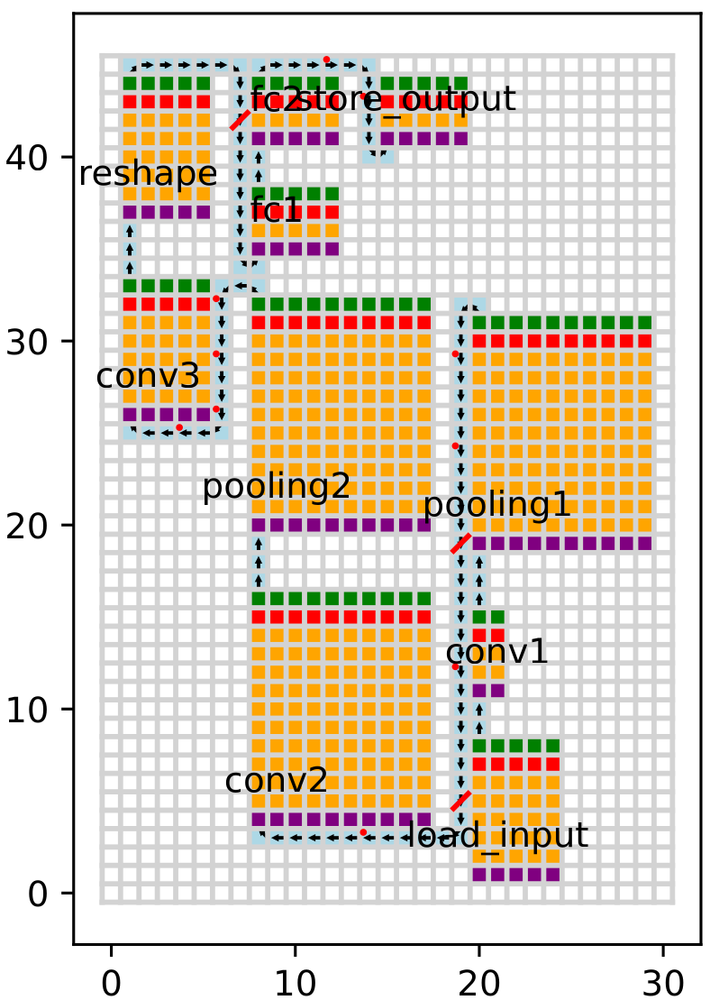

# NoC Wire Synthesis

This process is to synthesize the path created by the routing process using more realistic wire-like components. There are three types of components that are used in the synthesis process. They are:

- Wire
- Buffered Wire
- Registered Wire

It is important to perform this synthesis step before the scheduling process because the scheduling process requires the latency of each communication path in terms of clock cycles.

## Wire Synthesis

### Direction Selection

Based on the path created by the routing process, we need to select the direction of each wire segment.

### Timing Selection

<!-- prettier-ignore -->
!!! warning
    This is a work in progress. The wire synthesis process is not yet implemented. The current code just randomly assign the wire type to the path.

## Example

