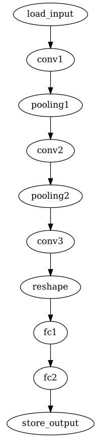
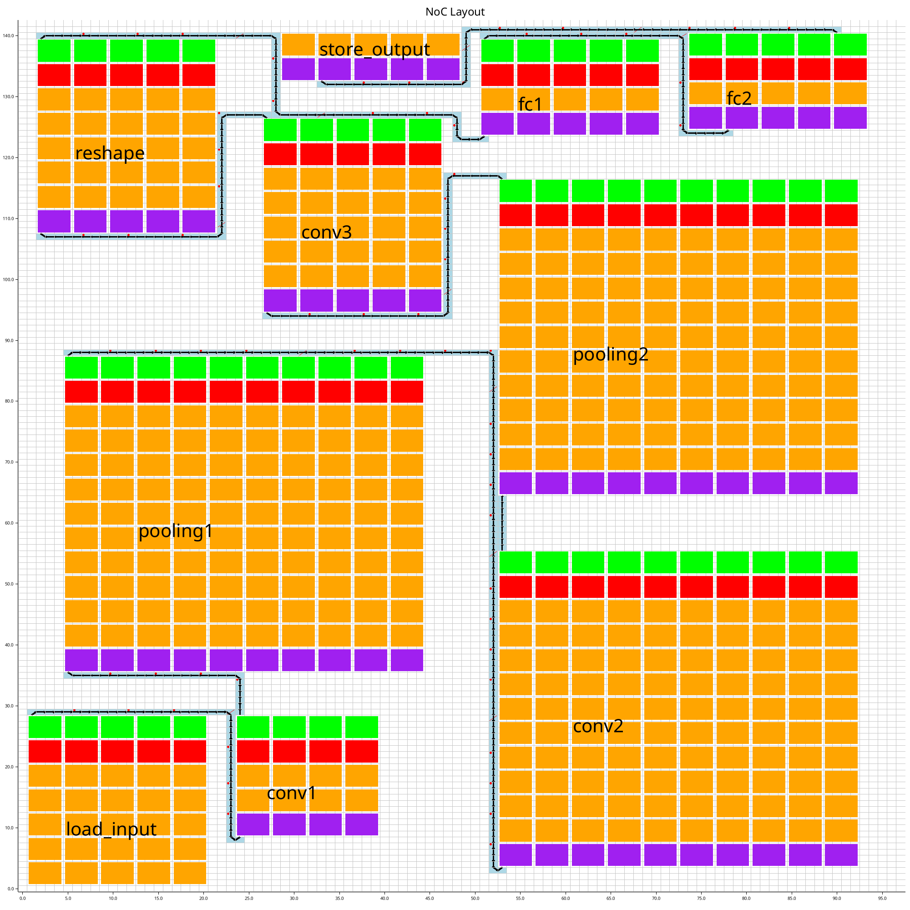
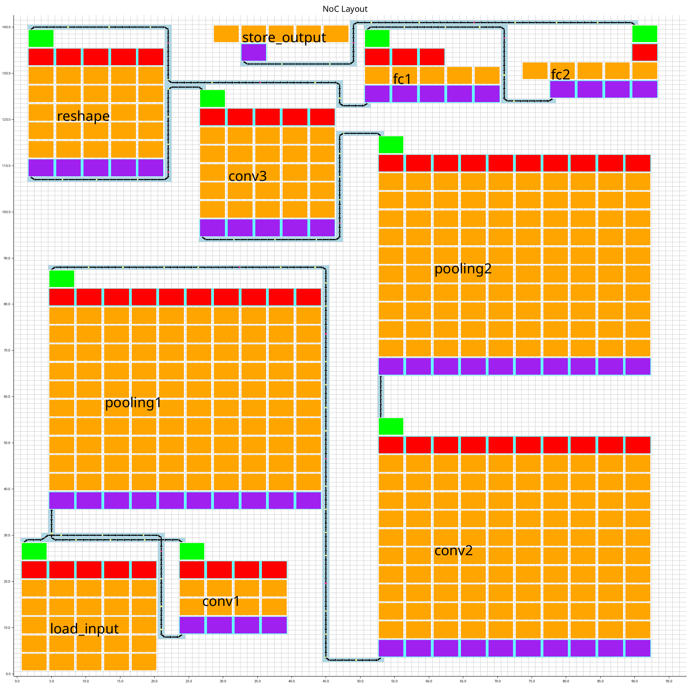

# Tutorial

## Create a test example

To create input files necessary to run lenet5 example, you simply need to run execute the following command in the main directory, where `{}` is the name of our wanted application in the testcase program. Now, available test applications are `minimum`, `copy`, `sobel`, and `lenet5`.

```
./bin/config --name {} --output config
```

After that, five input configuration files for the test application will be generated in ``config/`` directory, which in fact can be somewhere else by changing the name of ```--output``` argument.

## Run Sylva

The Sylva Tool chain has two binaries to run 1) Design Space Exploration (DSE) to work on the application space and 2) Assembly (ASM) to optimise and generate the output representation.

### Design Space Exploration (DSE)

We provided a script file (``run.sh``) calling __*./bin/sv-dse*__ to run the program. You can type ```./bin/dse -h``` to see the arguments required for the program as also provided below.

```
>> ./bin/sv-dse -h
Arguments to get the configuration files and output directory

Usage: sv-dse --graph <GRAPH> --constraint <CONSTRAINT_FILE> --library <ALIMP_LIB> --parameter <HYPER_PARAMETER> --technology <TECHNOLOGY_CONSTRAINT> --output <OUTPUT>

Options:
  -g, --graph <GRAPH>                       SDF graph file
  -c, --constraint <CONSTRAINT_FILE>        global constraint file
  -l, --library <ALIMP_LIB>                 alimp library file
  -p, --parameter <HYPER_PARAMETER>         hyper parameter file
  -t, --technology <TECHNOLOGY_CONSTRAINT>  technology constraint file
  -o, --output <OUTPUT>                     output directory
  -h, --help                                Print help
  -V, --version                             Print version
```

Although you can also manually set the locations of each configuration, by defualt, all of them except ``output`` are pointed to ``config/`` with their specified file names if you generated these files using the above command. The output is located to ``out/`` in the ```./run.sh``` script. So, simply type the following command to run Sylva Design Space Exploration tool to execute input files in ```config/``` and set the working directory to ```out/```. 

```
>> ./run.sh
```

You can expect the tool to generate multiple files and folders inside the output directory you specified as ```out/```, but the actual output of this Design Space Exploration process is stored in the json file ```out/db.bin```. Some folders also contain vitualisable images for the output of the first step of Sylva. This execution also performs the DSE Simulator to verify the outputs of the DSE process. 

### Assembly (ASM)

The second step of Sylva __*./bin/sv-asm*__ takes the intermediate representation generated by the DSE binary, ```out/db.bin``` in this example. 

```
>> ./bin/sv-asm -h
Arguments to get the configuration files and output directory

Usage: sv-asm --intermediate-representation <IR_OBJECT> --binary <OUTPUT>

Options:
  -i, --intermediate-representation <IR_OBJECT>  Input Intermediate Representation Object
  -o, --binary <OUTPUT>                          output directory
  -h, --help                                     Print help
  -V, --version                                  Print version
```

To execute the Assembly part of Sylva, run the following command to take the output of DSE as input also known as ```out/db.bin```. This part of the tool chain also creates a number of folders and files in the working directory, and similarly to the first part, it generates the output json file of this step called ```out/db_asm.bin```.

```
>> ./bin/sv-asm -i out/db.bin -o out
```

## lenet5 Example

### Introduction

The application consists of 10 SDF nodes where the first and the last one are loading the data and storing the result, respectively. Other nodes perform their functionalities as described in ``examples/lenet5/`` (You will have to install the tool chain first if you do not see this). While running the tool chain both DSE and ASM parts, you can expect to see a lot of messages popping in the terminal and some parts of the process may take a while longer than the others.

<p align="center">
    
</p>


### DSE Synthesis

The input configurations will go through stages of selection and optimisations as we have binding, placing, routing, noc synthesis, and glic synthesis in DSE. Normally, after each step is done, we will be able to vitualise its result in ```{output}/```. A NoC synthesis result, for exmaple, is available in ```{output}/noc/layout_graph.pdf```. 

After this process is done, it writes a binary file called ``{output}/db.bin`` as a result database file. Note that ```{output}``` is a directory set by sylva executable. It is set to ```out/``` by defualt when you run the provided ```./run.sh``` script.

<p align="center">
    
</p>


#### Simulation Part


This DSE Synthesis makes use of the DSE Simulator called ```sv-sim``` which can be found in ```bin``` directory. It will be automatically invorked by the program after the main compilation of DSE. The interface between these two programs are simply files in specific formats that are known by both Tool Chain and the simulator. The simulator uses the executables located at ```examples/{name}/```, where {name} is the targeted application name, and also some additional data in ``examples/{name}/data/``, if any. Since this lenet5 is a simple graph that has no splits or merges, we can see here in below log that it starts from the entry node, its corresponding transporter, conv1 node, and so on uptil the exit node.

Because we provide two memory images for simulation: one is the initial image and the other is supposed to be the correct image after running the simulation. It will compare the two images at the end and shows ```Failed to verify the simulation``` after this line ```[INFO  sylva::sim]  Finish: ideal simulation```, if the images do not match. Otherwise, it will not display the line as you can see in the log.

```
[2025-08-07T13:49:32Z INFO  sylva::sim] Start: simulation
[2025-08-07T13:49:32Z INFO  sylva::sim] Stage 1: generate simulation files
[2025-08-07T13:49:32Z INFO  sylva::sim] Stage 2: run simulation

[stdout] Instantiating: fc2
[stdout] Instantiating: fc1
[stdout] Instantiating: store_output
[stdout] Instantiating: pooling2
[stdout] Instantiating: pooling1
[stdout] Instantiating: transporter_edge_load_input_conv1
[stdout] Instantiating: transporter_edge_conv2_pooling2
[stdout] Instantiating: transporter_edge_pooling2_conv3
[stdout] Instantiating: transporter_edge_reshape_fc1
[stdout] Instantiating: conv1
[stdout] Instantiating: transporter_edge_pooling1_conv2
[stdout] Instantiating: conv3
[stdout] Instantiating: conv2
[stdout] Instantiating: transporter_edge_fc1_fc2
[stdout] Instantiating: transporter_edge_conv1_pooling1
[stdout] Instantiating: transporter_edge_conv3_reshape
[stdout] Instantiating: reshape
[stdout] Instantiating: transporter_edge_fc2_store_output
[stdout] Instantiating: load_input
[stdout] Completed initalisation process.
[stdout] 
[stdout] [@0] Triggering: load_input
[stdout] [@0] Starting.
[stdout] [@0] Trigger process module.
[stdout] Main process is preparing to run: examples/lenet5/load-input --addr 0 --size 64 --global-image out/sim/mem/global_mem_image.json --out-mem out/sim/mem/load_input_outMem.json
[stdout] Process output = 
[stdout] [@0] Starting output Addr Translation.
[stdout] [@237] Output Addr Translation done.
[stdout] Finishing: load_input
[stdout] 
[stdout] [@0] Triggering: transporter_edge_load_input_conv1
[stdout] [@0] Starting.
[stdout] [@0] Trigger Transporter.
[stdout] [@0] Transferring data from load_input to conv1
[stdout] Transporter done.
[stdout] Finishing: transporter_edge_load_input_conv1
[stdout] 
[stdout] [@61] Triggering: conv1
[stdout] [@61] Starting.
[stdout] [@61] Trigger process module.
[stdout] [@61] Starting input Addr Translation.
[stdout] [@241] Input Addr Translation done.
[stdout] Main process is preparing to run: examples/lenet5/conv --input_image_channel 1 --input_image_size 32 --kernel_channel 6 --kernel_size 5 --stride 1 --kernel examples/lenet5/data/conv1_kernel.json --bias examples/lenet5/data/conv1_bias.json --global-image out/sim/mem/global_mem_image.json --in-mem out/sim/mem/conv1_inMem.json --out-mem out/sim/mem/conv1_outMem.json
[stdout] Process output = 
[stdout] [@61] Starting output Addr Translation.
[stdout] [@1453] Output Addr Translation done.
[stdout] Finishing: conv1
[stdout] 
[stdout] [@0] Triggering: transporter_edge_conv1_pooling1
[stdout] [@0] Starting.
[stdout] [@0] Trigger Transporter.
[stdout] [@0] Transferring data from conv1 to pooling1
[stdout] Transporter done.
[stdout] Finishing: transporter_edge_conv1_pooling1
[stdout] 
[stdout] [@76] Triggering: pooling1
[stdout] [@76] Starting.
[stdout] [@76] Trigger process module.
[stdout] [@76] Starting input Addr Translation.
[stdout] [@1460] Input Addr Translation done.
[stdout] Main process is preparing to run: examples/lenet5/pooling --input_image_channel 6 --input_image_size 28 --kernel_size 2 --stride 2 --mode average --global-image out/sim/mem/global_mem_image.json --in-mem out/sim/mem/pooling1_inMem.json --out-mem out/sim/mem/pooling1_outMem.json
[stdout] Process output = 
[stdout] [@76] Starting output Addr Translation.
[stdout] [@470] Output Addr Translation done.
[stdout] Finishing: pooling1
[stdout] 
[stdout] [@0] Triggering: transporter_edge_pooling1_conv2
[stdout] [@0] Starting.
[stdout] [@0] Trigger Transporter.
[stdout] [@0] Transferring data from pooling1 to conv2
[stdout] Transporter done.
[stdout] Finishing: transporter_edge_pooling1_conv2
[stdout] 
[stdout] [@113] Triggering: conv2
[stdout] [@113] Starting.
[stdout] [@113] Trigger process module.
[stdout] [@113] Starting input Addr Translation.
[stdout] [@481] Input Addr Translation done.
[stdout] Main process is preparing to run: examples/lenet5/conv --input_image_channel 6 --input_image_size 14 --kernel_channel 16 --kernel_size 5 --stride 1 --kernel examples/lenet5/data/conv2_kernel.json --bias examples/lenet5/data/conv2_bias.json --global-image out/sim/mem/global_mem_image.json --in-mem out/sim/mem/conv2_inMem.json --out-mem out/sim/mem/conv2_outMem.json
[stdout] Process output = 
[stdout] [@113] Starting output Addr Translation.
[stdout] [@760] Output Addr Translation done.
[stdout] Finishing: conv2
[stdout] 
[stdout] [@0] Triggering: transporter_edge_conv2_pooling2
[stdout] [@0] Starting.
[stdout] [@0] Trigger Transporter.
[stdout] [@0] Transferring data from conv2 to pooling2
[stdout] Transporter done.
[stdout] Finishing: transporter_edge_conv2_pooling2
[stdout] 
[stdout] [@162] Triggering: pooling2
[stdout] [@162] Starting.
[stdout] [@162] Trigger process module.
[stdout] [@162] Starting input Addr Translation.
[stdout] [@802] Input Addr Translation done.
[stdout] Main process is preparing to run: examples/lenet5/pooling --input_image_channel 16 --input_image_size 10 --kernel_size 2 --stride 2 --mode average --global-image out/sim/mem/global_mem_image.json --in-mem out/sim/mem/pooling2_inMem.json --out-mem out/sim/mem/pooling2_outMem.json
[stdout] Process output = 
[stdout] [@162] Starting output Addr Translation.
[stdout] [@549] Output Addr Translation done.
[stdout] Finishing: pooling2
[stdout] 
[stdout] [@0] Triggering: transporter_edge_pooling2_conv3
[stdout] [@0] Starting.
[stdout] [@0] Trigger Transporter.
[stdout] [@0] Transferring data from pooling2 to conv3
[stdout] Transporter done.
[stdout] Finishing: transporter_edge_pooling2_conv3
[stdout] 
[stdout] [@231] Triggering: conv3
[stdout] [@231] Starting.
[stdout] [@231] Trigger process module.
[stdout] [@231] Starting input Addr Translation.
[stdout] [@551] Input Addr Translation done.
[stdout] Main process is preparing to run: examples/lenet5/conv --input_image_channel 16 --input_image_size 5 --kernel_channel 120 --kernel_size 5 --stride 1 --kernel examples/lenet5/data/conv3_kernel.json --bias examples/lenet5/data/conv3_bias.json --global-image out/sim/mem/global_mem_image.json --in-mem out/sim/mem/conv3_inMem.json --out-mem out/sim/mem/conv3_outMem.json
[stdout] Process output = 
[stdout] [@231] Starting output Addr Translation.
[stdout] [@720] Output Addr Translation done.
[stdout] Finishing: conv3
[stdout] 
[stdout] [@0] Triggering: transporter_edge_conv3_reshape
[stdout] [@0] Starting.
[stdout] [@0] Trigger Transporter.
[stdout] [@0] Transferring data from conv3 to reshape
[stdout] Transporter done.
[stdout] Finishing: transporter_edge_conv3_reshape
[stdout] 
[stdout] [@247] Triggering: reshape
[stdout] [@247] Starting.
[stdout] [@247] Trigger process module.
[stdout] [@247] Starting input Addr Translation.
[stdout] [@735] Input Addr Translation done.
[stdout] Main process is preparing to run: examples/lenet5/reshape --input_row 120 --input_col 1 --output_row 1 --output_col 120 --global-image out/sim/mem/global_mem_image.json --in-mem out/sim/mem/reshape_inMem.json --out-mem out/sim/mem/reshape_outMem.json
[stdout] Process output = 
[stdout] [@247] Starting output Addr Translation.
[stdout] [@289] Output Addr Translation done.
[stdout] Finishing: reshape
[stdout] 
[stdout] [@0] Triggering: transporter_edge_reshape_fc1
[stdout] [@0] Starting.
[stdout] [@0] Trigger Transporter.
[stdout] [@0] Transferring data from reshape to fc1
[stdout] Transporter done.
[stdout] Finishing: transporter_edge_reshape_fc1
[stdout] 
[stdout] [@266] Triggering: fc1
[stdout] [@266] Starting.
[stdout] [@266] Trigger process module.
[stdout] [@266] Starting input Addr Translation.
[stdout] [@291] Input Addr Translation done.
[stdout] Main process is preparing to run: examples/lenet5/fc --input_size 120 --output_size 84 --weight examples/lenet5/data/fc1_weight.json --bias examples/lenet5/data/fc1_bias.json --activation=tanh --global-image out/sim/mem/global_mem_image.json --in-mem out/sim/mem/fc1_inMem.json --out-mem out/sim/mem/fc1_outMem.json
[stdout] Process output = 
[stdout] [@266] Starting output Addr Translation.
[stdout] [@297] Output Addr Translation done.
[stdout] Finishing: fc1
[stdout] 
[stdout] [@0] Triggering: transporter_edge_fc1_fc2
[stdout] [@0] Starting.
[stdout] [@0] Trigger Transporter.
[stdout] [@0] Transferring data from fc1 to fc2
[stdout] Transporter done.
[stdout] Finishing: transporter_edge_fc1_fc2
[stdout] 
[stdout] [@279] Triggering: fc2
[stdout] [@279] Starting.
[stdout] [@279] Trigger process module.
[stdout] [@279] Starting input Addr Translation.
[stdout] [@313] Input Addr Translation done.
[stdout] Main process is preparing to run: examples/lenet5/fc --input_size 84 --output_size 10 --weight examples/lenet5/data/fc2_weight.json --bias examples/lenet5/data/fc2_bias.json --activation=softmax --global-image out/sim/mem/global_mem_image.json --in-mem out/sim/mem/fc2_inMem.json --out-mem out/sim/mem/fc2_outMem.json
[stdout] Process output = 
[stdout] [@279] Starting output Addr Translation.
[stdout] [@279] Output Addr Translation done.
[stdout] Finishing: fc2
[stdout] 
[stdout] [@0] Triggering: transporter_edge_fc2_store_output
[stdout] [@0] Starting.
[stdout] [@0] Trigger Transporter.
[stdout] [@0] Transferring data from fc2 to store_output
[stdout] Transporter done.
[stdout] Finishing: transporter_edge_fc2_store_output
[stdout] 
[stdout] [@281] Triggering: store_output
[stdout] [@281] Starting.
[stdout] [@281] Trigger process module.
[stdout] [@281] Starting input Addr Translation.
[stdout] [@284] Input Addr Translation done.
[stdout] Main process is preparing to run: examples/lenet5/store-output --addr 64 --size 1 --global-image out/sim/mem/global_mem_image.json --in-mem out/sim/mem/store_output_inMem.json
[stdout] Process output = 
[stdout] Finishing: store_output
[stdout] 
[stdout] Exiting simulation

[2025-08-07T13:49:32Z INFO  sylva::sim] Stage 3: verify simulation
[2025-08-07T13:49:32Z INFO  sylva::sim] Finish: simulation
[2025-08-07T13:49:32Z INFO  sylva] Sylva finished successfully!
```


### ASM Synthesis

The Assembly process takes the DSE-synthesised data and further optimises it to make the final result be more practical in terms of hardware description and as optimal as possible in performance metrics. The figure below shows the layout of the lenet5 application after the Assembly process, which can be found in ```{output}/reassign-noc/layout_graph.png```. You can notice several changes in the layout where the memory components (Red and Purple) and transporters (Green) are realised as hardware component and optimized. The final result of this Assembly process is stored at ```{output}/db_asm.bin```. This process is still ongoing, and more detailed steps will be added.


<p align="center">
    
</p>
