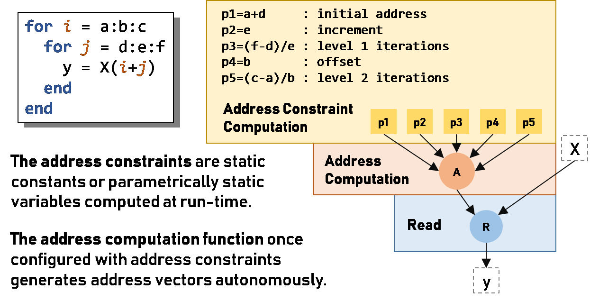
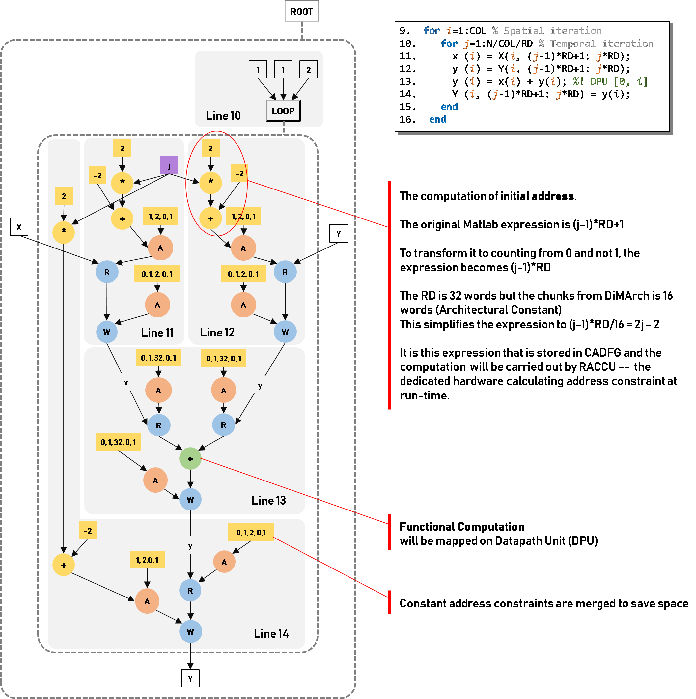

# CADFG - Control Address Data-Flow Graph

CADFG is a DAG(directed acyclic graph)-based data structure used as an intermediate representation (IR) by Vesyla. Conventional High-level synthesis (HLS) tools typically model high-level program as control and dataflow graph (CDFG) as the intermediate representation (IR). This representation was appropriate because HLS tools synthesize an FSMD (FSM+Datapath) as the target architecture, deal with scalars and do not differentiate between functional, address and address constraints computation. Vesyla-II, in contrast generates distributed two-level FSM control scheme, deals with vectors and differentiates between the three categories of computation. These differences are reflected in the the IR used by Vesyla-II called Control, Address and Dataflow Graph (CADFG). CADFG is derived from the abstract syntax tree (AST). By a series of refinement, it transforms to Instruction Dependent Graph (IDG) as the back-end IR. In this section, we focus on elaborating some of the critical vertices of CADFG.


## Vertices
There are several broad categories of vertices in CADFG:

1. **Source and Sink vertices**: create and terminate data flow.
2. **Read and Write vertices**: slice vector to scalar and pack scalar to vector.
3. **Address and Address Constraint vertices**: generates the address sequence for slicing and packing and address constraints.
4. **Function vertex**: does general data computation.
6. **Control vertices**: handle branches and loops.


### Source and Sink Vertices

Source vertices doesn't have any input port and sink vertices doesn't have any output port. Both types of vertices support both vector and scalar data type. In figure ??, ```p1``` to ```p5``` and ```X``` are all source vertices, while ```y``` is sink vertex.

### Read and Write Vertices

Read vertex slices the vector variable to its each individual element and sending out them one at a time. On the contrary, write vertex packs the time distributed scalar data sequence to vector variable. Both vertices need an address vertex attach to them in order to decide the address sequence. In figure ??, vertex ```R``` is an example of read vertex.

### Address and Address Constraint Vertices

Address and Address Constraint Vertices are the key differentiator compared to conventional CDFGs. These vertices embody the policy of differentiating address and address constraints as separate computation category and mapping them to dedicated spatially distributed resources. This manifests in the read vertex getting its addresses from a function that models the address computation as a two-level affine function with five operands as shown and explained with an example in Figure ??. An implication of such an address function is that read vertex does not read a scalar but a vector. The address constraints are also explicitly identified to enable their computation to be also mapped to custom spatially distributed computation resource.

In following figure, vertex ```A``` is an address vertex.



When Vesyla encounters higher order address functions beyond two levels affine function, it repeatedly computes the constraints of the inner two-level loops in a pipelined fashion. Computation in pipelined fashion deserves some explanation. Let us call one instance of innermost two loops as an epoch. While the functional computation and address computation of the innermost two loops are working on epoch i, the address constraints for the next epoch, i+1, are computed in parallel on an independent machine as shown in the following figure.

<center></center>

### Function Vertex

Function vertices are responsible for the actual computation on input data. They are usually bind to arithmetic units inside DRRA cells. Function vertices only accept scalar inputs and generate scalar outputs. That's why we have the read and write nodes to break down the vector variables.

Function vertex can be chained together to form more complex arithmetic operation.

### Control Vertex

Control vertices model the control hierarchy and in this respective they are similar to the control vertices in typical CDFGs. These vertices model the main algorithmic level control and not the control for fine grained address and address constraints computation. In CADFG, we do not have explicit control edges to model control dependencies. This is implicitly represented by the hierarchy of the control blocks. All nodes inside a control block are implicitly triggered if the control condition and the data dependency condition of the control block is fulfilled. When an algorithm is parallelized, parts of control hierarchy are replicated to represent the parallelism. Loops in Vesyla are not dynamic, they are either compile time or parametrically static. The latter implies that once the parameter for the loop bounds and increment are decided, these parameters remain static until the loop is complete. The dedicated resources for address constraints computation also serve to manage the loop parameters or constraints. For this reason, CADFG loop vertices are composite, i.e., they do not have any separate datapath vertex for loop condition comparison. Typical HLS tools, on the other hand, instantiate comparators and incrementors/adders to implement loop control verteices.

Control Vertices include branch vertex, loop vertex, merge vertex, etc.

## Edges

There are two broad categories of edges in CADFG:

1. **Dataflow edge**: represents the flow of data, either scalar or vector.
2. **Dependency edge**: represents the dependency relation between the predicessor and successor.

### Dataflow Edge

Like in conventional CDFG, dataflow edge shows the flow of data. It's a directed edge with predicessor and successor. Data flows from predicessor to successor. Dataflow edge can be either scalar or vector.

Dataflow edge automatically embeds the information of dependency. The successor cannot be scheduled earlier than the predicessor.

### Dependency Edge

Dependency edge is a more sophiscated way to describe dependencies among vertices. Vesyla uses dependency edges because in order to solve some hazzards such as "WAR" and "WAW",  extra dependency information is needed and these information can't be provided by normal dataflow edges.

A dependency edge is also a directed edge. A timing period is associated with each dependency edge to indicate that the successor should start after the predicessor after some time $t$ and $t$ should be bounded by the timing period associated with the dependency edge.

Each terminal of the edge also has a property indicating the moment the dependency edge will start to apply. The property can be **PROCESS BEGIN** or **PROCESS END**. Thus, a dependency edge $a \rightarrow{} b$ can express 4 different types of dependencies.

1. $b$ starts after $a$ starts.
2. $b$ starts after $a$ ends.
3. $b$ ends after $a$ starts.
4. $b$ ends after $a$ ends.

## Example



1.	Lines 1 to 4 are the symbolic parameters that control the dimension of the algorithm and also the allocation and binding. These parameters influence the dimension of the CADFG. For instance, the parameter Col decides the degree of parallelism. The CADFG shown in figure corresponds to Col=1 case. If Col > 1, Vesyla would replicate the CADFG Col times to represent the parallelism.
2.	Lines 5 to 8 define the allocation and binding for the storage. This information is stored as attributes in the source and destination nodes of the read/write nodes in the CADFG.
3.	Lines 9 to 16 decide the dimension and structure of the CADFG. The control hierarchy is represented by hierarchy of control blocks that serves as containers. In CADFG, there are no explicit control arcs but being inside a control block implies having a control arc from the parent control block. 
4.	Line 9 refers to spatial iteration, i.e., parallelism and as stated above, decides the number of replications of CADFG. Line 10 is the highest control node that will be executed in each thread; CADFG in figure has a single thread with Col=1. Inside this control block, there are three sub-control blocks, each representing a vector operation on lines 11, 12 and 14. Two of these control blocks enclose read nodes and one write node. Besides these three read/write nodes, there is a functional computation node to represent the functionality on line 13.
5.	The read/write nodes that model the vector movement in lines 11, 12 and 14 all have the address and address constraints computation nodes for both LHS and RHS. Potentially, all three nodes could involve three sets of spatially distributed FSMs for address and address computations. Later, factoring in the allocation, binding and the data dependenncies, Vesyla synthesizes strucutures and details for scheduling and synchronizing these FSMs, some of them could be mapped to the same FSM.
6.	A simplification process in Vesyla transforms the symbolic expressions in Matlab to numerical values for loop and address constraints. A boxed note in figure explains one such example for address constraints for LHS of line 11.
7.	In the example under consideration, there is only one functional computation node on line 13 and as can be seen its inputs and outputs are also vectorizing read/write nodes. Also, the functional computational node is also associated with an allocation and binding pragmas that is duly recorded as part of building the CADFG.
8.	While building the CADFG, Vesyla, like other HLS tools also creates explicit data dependencies that crosses control block boundaries. Vesyla also detect hazards and records them with additional dependency arcs. This is explained next.
