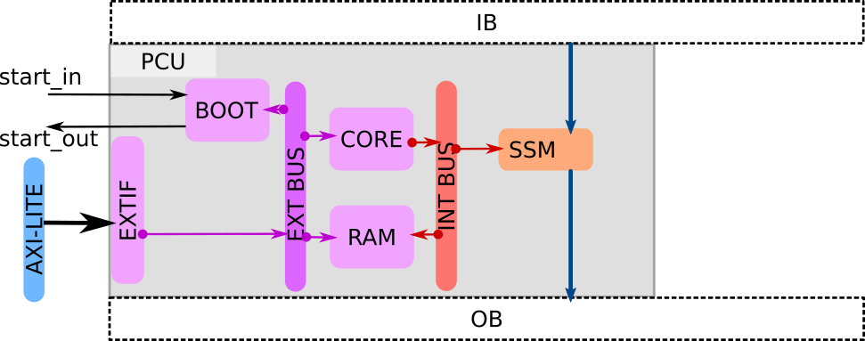

# Full System (AlImp) View

## Overview

The full AlImp system is a accelerator peripheral that is attached to a AMBA AXI bus (see [AXI protocol](https://developer.arm.com/documentation/dui0534/b)) and controlled by a single host CPU through the AXI bus.

An AlImp can be configured in three different modes to accommodate various computational needs. Each configuration must contain a CORE, a RAM, and a BUS. Depending on the application, the system can include either the Scalar Scratch-pad Memory (SSM), the Vector Processing Interface (VPI), or both.

### Configuration 1: Scalar Computation Mode

Scalar Computation Mode is optimized for tasks that require sequential processing and complex control sequence. In this configuration, the system includes the PCU and SSM, allowing for efficient handling of scalar data types. The actual scalar data processing is performed by the CORE. The SSM is just a scratch-pad buffer interface between the IO and the CORE.

This mode is extremely slow since the CORE is not optimized for data processing. Usually we only use this mode for fast prototyping and simple control intensive tasks.

### Configuration 2: Vector Computation Mode

Vector Computation Mode is designed for applications that benefit from parallel processing of data. In this setup, the system contains the VPI and the DRRA fabric, enabling high-throughput processing of vector data types. The VPI handles the communication between the CORE and the DRRA. All data processing is done by the DRRA fabric.

### Configuration 3: Hybrid Computation Mode

Hybrid Computation Mode combines the strengths of both scalar and vector processing. This configuration includes the both SSM, and VPI, allowing for versatile computation capabilities. The CORE+SSM handles the scalar data and VPI+DRRA handles vector data.

This mode is the most used mode since it mainly targets vector computation workload while still having the flexibility to handle scalar computation when needed.

## Processor Control Unit (PCU)

### EXTIF

The EXTIF is the external interface that connects the PCU to the AXI bus. It is a simple AXI slave interface that maps the internal BUS to the AXI bus. The AXI bus is usually connected to a host CPU that controls the PCU through memory-mapped IO.

The EXTIF handles all AXI transactions and translates them to simple read/write requests to the peripherals connected on the external side: BOOT, CORE, as well as RAM.

### BOOT

The BOOT is a simple model that accept a `start_in` signal and produce a `start_out` signal after a fixed number of clock cycle delay. The delay can be configured through the AXI bus. The `start_out` signal triggers the CORE to start executing the program from the address 0x0000_0000 in the RAM and it also goes out the Alimp to trigger downstream modules.

The BOOT module is mapped to address 0X000C_0000 ~ 0x000C_FFFF on the AXI bus.

### CORE

The CORE is a RISC-V CPU core implemented using [picorv32i](https://github.com/YosysHQ/picorv32).

The CORE is mapped to address 0x000D_0000 ~ 0x000D_FFFF on the AXI bus.

### RAM

The RAM is a working memory for the CORE. It contains the program code, data section, and stack. The memory space is from 0x0000_0000 to 0x000B_FFFF. The RAM is connected to both the external bus and the internal bus. Both buses use the same address space to access the RAM.

The RAM only has one set of read and write ports that are shared by the CORE and the EXTIF. A simple arbiter is implemented to handle the access contention. Basically, if the CORE is busy, it's not allowed to write to the RAM via external bus.

### Scalar Scratch-pad Memory (SSM)

The SSM unit load data from the input buffer (IB) to the internal buffer (BUF) and store data from the BUF to the output buffer (OB). It is mainly used as a scratch-pad memory for the CORE to handle scalar data. The address space of the SSM is from 0x000C_0000 to 0x000C_FFFF on the internal bus.

The internal BUF has a single input port and a single output port. Writing/Reading BUF from/to IO buffers and the CORE have to share the same port. The I/O buffers have higher priority than the CORE. If the BUF is busy handling IO requests, the CORE has to wait.

### Vector Processing Interface (VPI)

The VPI is the interface between the CORE and the DRRA fabric. It includes three sub-modules: It handles the instruction loading, kernel calling, and scalar register exchange between the CORE and the DRRA cells.

## Dynamic Reconfigurable Register Array (DRRA)

The DRRA is a 2D array of cells that can be dynamically reconfigured to form different data paths for various applications.

## IO

The IO includes two virtual memories: Input Buffer (IB) and Output Buffer (OB). They both are modeled inside the testbench and does not exist in the actual hardware.
