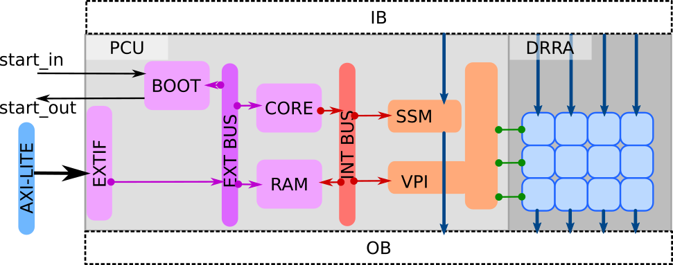

# Full System (AlImp) View

## Overview

The full AlImp system is a accelerator peripheral that is attached to a AMBA AXI bus (see [AXI protocol](https://developer.arm.com/documentation/ihi0024/latest/)) and controlled by a single host CPU through the AXI bus.

An AlImp can be configured in three different modes to accommodate various computational needs. Each configuration must contain a CORE, a RAM, and a BUS. Depending on the application, the system can include either the Scalar Scratch-pad Memory (SSM), the Vector Processing Interface (VPI), or both.

### Configuration 1: Scalar Computation Mode

Scalar Computation Mode is optimized for tasks that require sequential processing and complex control sequence. In this configuration, the system includes the PCU and SSM, allowing for efficient handling of scalar data types. The actual scalar data processing is performed by the CORE. The SSM is just a scratch-pad buffer interface between the IO and the CORE.

This mode is extremely slow since the CORE is not optimized for data processing. Usually we only use this mode for fast prototyping and simple control intensive tasks.

### Configuration 2: Vector Computation Mode

Vector Computation Mode is designed for applications that benefit from parallel processing of data. In this setup, the system contains the VPI and the DRRA fabric, enabling high-throughput processing of vector data types. The VPI handles the communication between the CORE and the DRRA. All data processing is done by the DRRA fabric.

### Configuration 3: Hybrid Computation Mode

Hybrid Computation Mode combines the strengths of both scalar and vector processing. This configuration includes the both SSM, and VPI, allowing for versatile computation capabilities. The CORE+SSM handles the scalar data and VPI+DRRA handles vector data.

This mode is the most used mode since it mainly targets vector computation workload while still having the flexibility to handle scalar computation when needed.

## Processor Control Unit (PCU)

### CORE

The CORE is a RISC-V CPU core implemented using [picorv32i](https://github.com/YosysHQ/picorv32)

### RAM

The RAM is a working memory for the CORE. It contains the program code, data section, and stack. The memory space is from 0x0000_0000 to 0x0000_BFFF.

### BUS

The bus connects the RISC-V core and peripherals. It is a [AMBA APB bus](https://developer.arm.com/documentation/ihi0024/latest/). All peripherals are memory-mapped in the address space from 0x0000_C000 to 0x0000_FFFF.

### Scalar Scratch-pad Memory (SSM)

#### Load Unit (LD)

The Load Unit (LD) handles data loading from the Input Buffer (IB) to the SSM internal buffer. It loads continuous 256-bit chunk of data.

#### Store Unit (ST)

The Store Unit (ST) handles data storing from the SSM internal buffer to the Output Buffer (OB). It stores continuous 256-bit chunk of data.

#### Internal Buffer (BUF)

The Internal Buffer (BUF) is a 1kB scratch-pad memory. It is organized as 32 rows of 256-bit data divided into 8 banks of 32-bit data. The BUF has two set of interfaces: one 256-bit interface to the LD and ST units, and one 32-bit interface to the BUS. The BUF is completely memory-mapped to the BUS address space.

### Vector Processing Interface (VPI)

#### Instruction Loading Unit (IL)

The Instruction Loading Unit (IL) handles instruction loading to the DRRA cells. It just forwards the instructions from the CORE to the DRRA cells.

#### Call Return Unit (CR)

The Call Return Unit (CR) can call a specific kernel whose instructions has already been loaded to the DRRA cells. After the call, it waits for the DRRA fabric to finish the execution and set a return flag to be true to indicate the end of execution. The CORE can periodically poll the return flag to check if the execution is done.

#### Scalar Register Exchange Unit (SRX)

The Scalar Register Exchange Unit (SRX) handles scalar register exchange between the CORE and the DRRA cells. It can set or get the value of a specific scalar register in any of the DRRA cells.

## Dynamic Reconfigurable Register Array (DRRA)

## IO

The IO includes two virtual memories: Input Buffer (IB) and Output Buffer (OB). They both are modeled inside the testbench and does not exist in the actual hardware.
