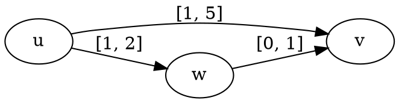
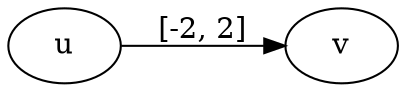
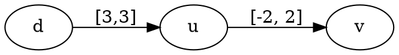
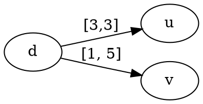
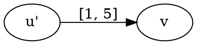
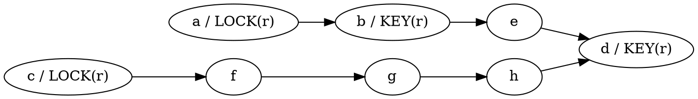
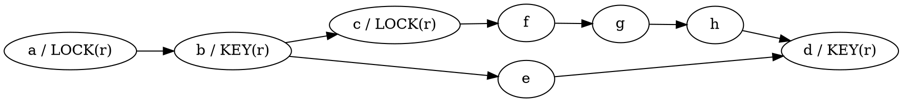

# Scheduling

## Problem Definition

In Vesyla, the generated instructions have fairly long life-time and are highly cooperative. Which means they are not just single-cycle actors with simple precedency relation that fight for resources. Instructions running in DRRA microthreads might actively coordinate themselves with other instructions executing in some other microthreads. Cooperation with other instructions can happen at any time when an instruction is alive and it can happen multiple times with multiple different other instructions. Further more, the life-time of an instruction in Vesyla can be undetermined and depend on other instructions in terms of both precedency relation and resource availability.

To simplify the scenario a little bit, we consider the **critical points** of those instructions as the atomic unit objects (jobs/actors/operations) that need to be scheduled in the cooperative instruction scheduling problem which will be defined later. What are the critical points? They can be starting and ending point of instructions. They can be the time points when a instruction change its resource usage. They can be the time points when a instruction need to coordinate with other instructions. In short, whenever an instruction changes anything, it's a critical point. Critical points don't have execution duration, it just represents a timestamp. However, critical points can have resource usage attached to it. Resource usage requires time duration.

With the usage of critical points, a new phenomenon appears. Some instructions can have undetermined life-time before scheduling. When those instructions are broken down into critical points, the resource usage of those critical points need special treatment since their usage duration are undetermined. We need to assign a **LOCK** resource usage frame to the critical point starting to use the resource and a **KEY** resource usage frame to the critical point finishing to use the resource. The resource between **LOCK** and **KEY** frame during scheduling should be marked **unavailable** to other critical points.

Cooperative instruction scheduling problem thus is very different from the classic instruction scheduling problem. In classic instruction scheduling problem, either positive or negative time-lag exists between a pair of instructions. While between a cooperative critical points pair, both minimal and maximum time-lag may exist, which constraints the precedence relation to a possibly closed time frame. A special case is when minimal and maximum time-lag are equal, representing the two critical points will have an exact time difference. The introduce of **LOCK** and **KEY** frame for resource usage is also very different from conventional instruction scheduling problem.

Now, we formally define the scheduling model and the scheduling problem.

!!! Warning
 MODEL AND PROBLEM DEFINITION

## Problem Simplification

The scheduling model defined above can not be used directly because it's high complexity creates a vast solution space and scheduling algorithm will have hard time to navigate to the correct direction.

Therefore, we propose one assumption and four simplification step to simplify the model. The simplification processes transform the model to equivalent but simpler model hence shrink the solution space.

### Delay bound assumption

Delay bounds of an edge in dependency graph can be either negative or positive as long as the higher bound $d_h$ is not less than lower bound $d_l$. An edge with $d_l=-\infty$ or with $d_l\le d_h \lt 0$ can be easily converted to an edge with $d_l\neq -\infty$ and $d_h\ge 0$. Therefore, we assume that: every edge in dependency graph will have a delay bounds satisfying $d_l\neq -\infty$, $d_h\ge 0$ and $d_l\le d_h$.

### Parking Hard-links

Hard-links are edges with constant delay ($d_l=d_h$). For example, $A\xrightarrow[]{\text{[w,w]}}B$ is a hard-link, it describes the constraint that the schedule time of B is exactly $w$ cycles after the schedule time of A.

All vertices linked by hard-links should be scheduled together, because if any vertex has been scheduled, the schedule time of other vertices which directly or indirectly linked to the scheduled vertex can be determined immediately. Therefore, packing hard-linked vertices together can reduce the size of graph and accelerate the scheduling process.

Pseudo Algorithm is shown below:

``` C++
Graph packing_hard_links(Graph g) {
  Graph g1 = remove_soft_links(g);
  Component C = find_connected_components(g1);
  Graph g2;
  for (auto c : C) {
    vector<Vertex, int> offset_map = find_offset_for_each_vertex(c);
    Vertex vc;
    Graph g3;
    for (auto v : c.vertices()) {
      v.schedule_time = offset_map(v);
      g3.add_vertex(v);
    }
    vc.add_child(g3) g2.add_vertex(vc);
  }
  for (auto e : edges(g)) {
    if (is_soft_link(e) && in_different_component(e.src, e.dest)) {
      Edge e1 = reshape_edge_accroding_to_g2(e);
      g2.add_edge(e1);
    }
  }
  return g2;
}
```

### Remove Redundant Edges

When analyzing the weighted edges in dependency graph (DG), it's easy to discover that there are some edges that have very related constraints which can be removed completely without loosing any synchronization constraint information of the original DG. Example below illustrate such scenario.



From the path $u \rightarrow v$, assuming $u$ starts at $t_0$, $v$ should start at the time period $[t_0+1,t_0+5]$. While from the path $u \rightarrow w \rightarrow v$, $v$ should start at the time period $[t_0+1,t_0+3]$. It's obvious that period $[t_0+1,t_0+5]$ is more relaxed than period $[t_0+1,t_0+3]$. The path $u \rightarrow v$ doesn't add any addition information, hence, can be removed.

### Negative Edge Weight Adjustment

In DG, weight can be period with negative integers. Therefore, if there is an edge $u \xrightarrow[]{\text[-2,2]} v$, though graphically the edge point from $u$ to $v$, it doesn't necessarily mean that after scheduling, $v$ is scheduled after $u$. The inconsistency between graph representation and the actual meaning of the weighted edge cause some troubles during later process. It would be much better if we can find a way to make them consistent.To adjust the weight of edges, the goal is to guarantee the weight period are strictly positive numbers.

Reader should keep in mind  what are the vertices in DG. They are just timestamp marking the critical time of each operation. There may be resource occupation table (ROT) attach to them. Suppose we have an edge like as following:



We can insert a dummy vertex $d$ with no ROT attach to it before $u$ with exactly 3 cycles ahead.



The edge $u \rightarrow v$ can be replaced by a new edge $d \rightarrow v$.



Edge $d \rightarrow u$ is always a hard edge, we can merge vertex $d$ and $u$ to a new vertex $u'$ with shifted ROT_u as its attached ROT.



In this way, every negative numbered weight can be converted to positive weight in DG.

### Resource Hazard Prediction

A well defined program will always have LOCK/KEY frame pair for any resource. A resource should never been locked and there is no KEY frame to unlock it, or vice versa. Different LOCK/KEY pair targeting the same resource will conflict with each other due to the resource occupation. The resource hazard should be resolved by scheduling via time multiplexing. However, in some scenario, if the scheduler don't schedule the vertices in a specific order, the scheduling might lead to un-schedulable situation due to resource occupation deadlock. Some exploration algorithms such as LIST scheduling engine might fail. While other scheduling engine such as Branch-and-Bound might stack to some corner space exploring for a very long time in order to find a valid solution. The following example clearly shows such scenario.



Vertex $c$ can be chosen by the scheduler to schedule first because it don't have any dependency from other vertices. The naturally, $f, g, h$ can be scheduled. But $d$ can not be scheduled because $e$ is not scheduled. $e$ can not be scheduled because $a$ can't be scheduled due to resource $r$ is locked by $c$. And $r$ is not can't be freed because $d$ can't be scheduled. This is a deadlock and will make this scheduling unfeasible. In order to correct the mistake, the scheduler (for example Branch-and-Bound) will try to trace back and to the step of scheduling $h$, then trace back again to $g$. Until it back-tracks to $c$, the very first scheduling step, the scheduler can't correct the mistake.

To solve such problem, we need to predict the scheduling order. By analyzing the graph structure, we should be able to conclude that $c$ should be scheduled after than $b$. We then force a constraint edge to explicitly represent such scheduling order in order to help the later exploring phase. The dependency graph after hazard prediction will be look like this:



## Solution Space Exploration

Scheduling is an NP-Complete problem. To find a valid solution for dependency graph, we need some solution searching engine or heuristic scheduling algorithm. Branch-and-Bound, Constraint Programming, LIST algorithm, Simulated Annealing, etc are such searching engines. In this section, we introduce two searching engine as an example to demonstrate how does the solution space exploration works.

### LIST Scheduling Algorithm
