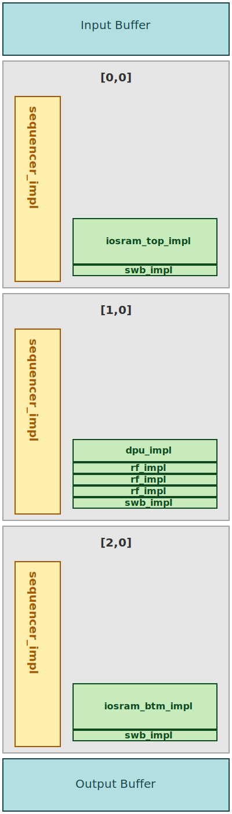
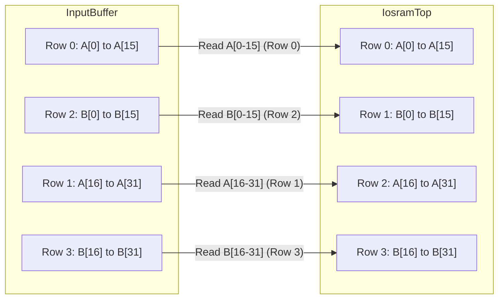
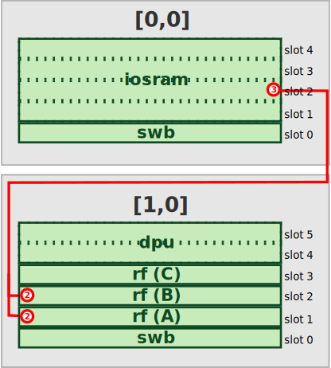
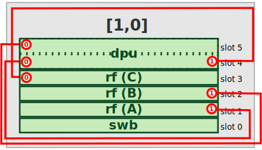

# PASM Language Programming Guide

## Introduction

Proto-Assembly (PASM) Language is a low-level language used to write programs for the DRRA architecture.
The language is designed to be simple and easy to understand, while still providing the necessary features to write complex programs.
Proto-Assembly Language are structured assembly language whose instructions are not yet scheduled.
It encodes control hierarchy but lack of timing information.
This guide will provide an overview of the language and how to use it to write programs.
In this guide, you will learn about the syntax of Proto-Assembly, and its constraints.

## File Types

Proto-Assembly Language uses the `.pasm` file extension for source files. These files contain the source code for a program written in Proto-Assembly Language.
Inside the `.pasm` file, you can write regions, operations, instructions, as well as constraints that define the behavior of the program.
The file is structured in a way that allows for hierarchical organization of the code, making it easier to read and maintain.

The output of the scheduling and synchronization process is a human-readable assembly language file with `.asm` as suffix and a binary file (currently it's in text format for debugging purpose) with `.bin` as suffix. See the following figure:


## Syntax for Proto-Assembly Language

### Comments

Comments in Proto-Assembly Language are denoted by the `#` character.
Anything after the `#` character on a line is considered a comment and is ignored by the compiler.

### Syntax Format

All regions, operations, and instructions follow the same syntax format. The syntax format is as follows:

```text
NAME <ID> (PARAM_0=VALUE_0, PARAM_1=VALUE_1, ...) {
    CONTENT_0
    CONTENT_1
    ...
}
```

However, different regions, operations, and instructions requires only some parts of the syntax format.
For example, **for_region** usually don't need the `ID` part;
Instructions don't have any contents.

For constraints, the syntax is slightly different. The syntax format for constraints is as follows:

```text
constraint ("CONSTRAINT CONTENT")
constraint ("CONSTRAINT CONTENT")
...
```

Note that the `CONSTRAINT CONTENT` must be a valid constraint expression that is accepted by minizinc.
See [MiniZinc Handbook](https://docs.minizinc.dev/en/stable/index.html) for more information about the constraint syntax.

The following EBNF grammar describes the syntax of Proto-Assembly Language:

```ebnf
start: (for_region | if_region | epoch_region)*

for_region: "for"   ("<" IDENTIFIER ">")? ("(" parameter ("," parameter)* ")") "{" (for_region | if_region | epoch_region)+ "}"
if_region: "if"   ("<" IDENTIFIER ">")? ("(" parameter ("," parameter)* ")") "{" (for_region | if_region | epoch_region)+ "}" ( "else" "{" (for_region | if_region | epoch_region)+ "}")?
epoch_region: "epoch" ("<" IDENTIFIER ">")? ("(" parameter ("," parameter)* ")")? "{" (cop_region | rop_region | raw_region | constraint)+ "}"

cop_region: "cop" ("<" IDENTIFIER ">")? ("(" parameter ("," parameter)* ")")? "{" instruction+ "}"
rop_region: "rop" ("<" IDENTIFIER ">")? ("(" parameter ("," parameter)* ")")? "{" instruction+ "}"
raw_region: "raw" ("<" IDENTIFIER ">")? "{" instruction+ "}"

instruction: IDENTIFIER ("<" IDENTIFIER ">")? ("(" parameter ("," parameter)* ")")?
constraint: "cstr" \( "\"" ANY "\"" \)
parameter: IDENTIFIER "=" (IDENTIFIER | NUMBER)

IDENTIFIER: /[_a-zA-Z][_a-zA-z0-9]*/
NUMBER: /[+-]?(0[xdob])?[0-9\.]+/

%import common.WS
%ignore WS
COMMENTS: /#.*/
%ignore COMMENTS
```

### Concepts

Regions and instructions are the basic building blocks of a program written in Proto-Assembly Language.
We introduce the following concepts to help you understand the structure of a program written in Proto-Assembly Language.

- **start** region represents the whole program. It contains one or more regions among **for**, **if**, and **epoch**.
- **for** region is a hierarchical region that contains one or more regions among **for**, **if**, and **epoch**.
- **if** region is a hierarchical region that contains one or more regions among **for**, **if**, and **epoch**.
- **epoch** region is a region that contains one or more operations among **cop**, **rop**, **raw** and **constraint**. Epochs are groups of instructions that are to be scheduled together.
- **rop** or **resource operation** is a region that contains one or more resource instructions.
- **cop** or **control operation** is a region that contains one or more control instructions.
- **raw** or **raw assembly operation** is a region that contains assembly instruction that do not need to be process by the scheduler.
- **control instructions** are instructions that are executed by a sequencer.
- **resource instructions** are instructions that are executed by a specific resource.
- **constraint** is a single line statement that specifies the constraint content. Each constraint is expressed by a relationship among operations, events, and anchors.

<!-- prettier-ignore -->
!!! note
    Proto-Assembly Language is case-sensitive. All keywords must be written in lowercase.

<!-- prettier-ignore -->
!!! note
    The **raw** region is not compatible with **cop** and **rop** regions. They are not allowed in the same **epoch** region. This is because the instruction scheduling process works on the entire **epoch**.
    Right now, the mix of **cop** and **rop** regions is not supported due to the complexity of the scheduling process. However, it is planned to be supported in a limited capacity in the future.

## Example

In this example, we explain how to write a simple PASM program to perform an element-wise vector multiplication.
The program will read two 32 values-wide vectors `A` and `B`, compute the element-wise multiplication of the two vectors and write the result to a third vector `C`.
The program will be structured using regions, operations, and instructions as described in the syntax format.

First, let's examine the hardware architecture that will be used to run the program. In this example, we use three cells (3 rows, 1 column). The top cell (cell[0,0]) is used as input scratchpad and communicate with the input buffer. The middle cell (cell[1,0]) is used to perform the computation and write the result to bottom cell. The bottom cell (cell[2,0]) is used as output scratchpad and communicate with the output buffer. The hardware architecture is shown in the following figure:



### Specifications

1. Switchbox (**swb**) is always the first resource (placed in slot 0). Switchbox implements the interface for intra-cell and inter-cell communication.
2. Slot 1 is always reserved for the input/output buffer interface. The input buffer and output buffer are used to communicate with other DRRA fabrics or with the external world.
3. Each slot has 4 communication ports, numbered as follows:

   | Port Number | Functionality                            |
   | ----------- | ---------------- |
   | 0           | Word-level input port |
   | 1           | Word-level output port |
   | 2           | Bulk-level input port |
   | 3           | Bulk-level output port |

    These port numbers can also be used to configure controllers or address generation units (AGUs). The functionality of each port number is defined by [resource specifications](/docs/ToolChain/Vesyla/Reference/ResourceSpecifications.md).
4. Intra-cell communication (word-level) data chunk is 16-bit and inter-cell communication (bulk-level) data chunk is 256-bit. IO interface also use the same 256-bit data chunk.

### Step 1: Create an epoch

In this example, the whole program can be written in a single **epoch** region so that all operations in the region can be scheduled together.
Inside the **epoch** region, we only need **rop** regions and **cstr** because all the program will be distributed and executed on each resource.
We don't need the **sequencer** to make any complicated control flow nor to perform scalar operations.
Thus, we will not use any **cop** region in this example.
We also don't need to write any raw assembly code, so we will not use any **raw** region in this example.
The epoch region can be written as follows:

```text
epoch {
    ... // rop regions
    ... // constraints
}
```

### Step 2: Read data from input buffer to the top scratchpad

In this step, we will read the input vectors `A` and `B` from the input buffer to the input scratchpad (iosram_top). Since each vector has 32 elements (each element is 16-bit), and each row in input buffer and iosram is 256-bit wide, we need 2 rows per vector. The data layout in the input buffer is as follows:


```mermaid
flowchart LR
    subgraph InputBuffer
        direction TB
        IB0["Row 0: A[0] to A[15]"]
        IB1["Row 1: A[16] to A[31]"]
        IB2["Row 2: B[0] to B[15]"]
        IB3["Row 3: B[16] to B[31]"]
    end

    subgraph IosramTop
        direction TB
        IT0["Row 0: A[0] to A[15]"]
        IT1["Row 1: B[0] to B[15]"]
        IT2["Row 2: A[16] to A[31]"]
        IT3["Row 3: B[16] to B[31]"]
    end

    IB0 -->|"Read A[0-15] (Row 0)"| IT0
    IB1 -->|"Read A[16-31] (Row 1)"| IT2
    IB2 -->|"Read B[0-15] (Row 2)"| IT1
    IB3 -->|"Read B[16-31] (Row 3)"| IT3
```

As we want to multiply the vectors element-wise, we should prioritize reading the same index of `A` and `B`.
Hence, the address pattern for reading the input buffer should be:

1. Read A[0-15] (Row 0)
2. Read B[0-15] (Row 2)
3. Read A[16-31] (Row 1)
4. Read B[16-31] (Row 3)

This is a two-level affine addressing scheme which can be expressed by an event **E** starting at address 0, represented by `dsu` instruction, and two nested levels of **R** operators, represented by `rep` instructions (see [Timing Model](../Explanations/TimingModel.md) for more information):

- evt initial address: 0
- rep level 0: iter=1, step=2, delay=0
- rep level 1: iter=1, step=1, delay=0

The IOSRAM is a large resource which occupies 4 slots.
Hence, a total of 16 ports can be addressed when configuring this resource.
However, according to the [resource specifications](/docs/ToolChain/Vesyla/Reference/ResourceSpecifications.md), we only need 6 of them to perform local control:

| Relative slot  | Port | Functionality                                                                                          |
| ----------- | --| ------------------------------------------------------------------------------------------------------ |
| 0 | 0 | Address generation for input buffer                                                                    |
| 0 | 1 | Address generation for output buffer                                                                   |
| 0 | 2 | Address generation for internal SRAM when receiving data from input buffer                             |
| 0 | 3 | Address generation for internal SRAM when sending data to output buffer                                |
| 1 | 2 | Address generation for internal SRAM when receiving via intercell communication |
| 1 | 3 | Address generation for internal SRAM when sending data via intercell communication     |

To read the data from the input buffer to the iosram, we need to create a **rop** region that generate address for the input buffer and another **rop** region that generate address for the iosram.
Therefore, we need to configure **slot0/port0** and **slot0/port2**.
However, as the iosram is placed at slot 1, the absolute slot number for iosram is slot 1. Therefore, the absolute slot/port number for reading data from the input buffer to the iosram_top is **slot1/port0** and **slot1/port2**.

The program for this step can be written as follows:

```text
# Read data from input buffer at addresses 0, 2, 1, 3
rop <input_r> (row=0, col=0, slot=1, port=0){
    dsu (init_addr=0)
    rep (iter=2, step=2, delay=0)
    rep (iter=2, step=1, delay=0)
}

# Write data to iosram_top at addresses 0, 1, 2, 3
rop <input_w> (row=0, col=0, slot=1, port=2){
    dsu (init_addr=0)
    rep (iter=4, step=1, delay=0)
}
```

Finally, we need to impose a constraint to ensure that the reading and writing operations are scheduled to run at the same time:

```text
cstr ("input_r == input_w")
```

### Step 4: Read data from the top cell's IOSRAM to register files in the middle cell

In this step, we will read the data from the IOSRAM in the top cell (cell[0,0]) to the register files in the middle cell (cell[1,0]).
The middle cell has 3 register files from slot 1 to slot 3.
Each register file has 4 ports.
The register files will be used to store the data of vector `A` and `B` and the result vector `C`.

#### Step 4.1: Build routing path from IOSRAM to register files

Before transferring data, we need to build the routing path from the IOSRAM to the register files.
The routing path is built by two cooperative **rop** regions: one for reading data from the cell[0,0]'s IOSRAM, the other for writing data to the register files in cell[1,0]. The routing path is shown in the following figure:



The PASM program for building the routing path can be written as follows:

```text
rop <route0r> (row=0, col=0, slot=0, port=1){
    route (option=0, sr=0, source=2, target= 0b010000000)
}
rop <route1w> (row=1, col=0, slot=0, port=1){
    route (option=0, sr=1, source=1, target= 0b0000000000000110)
}
```

The `route` instruction must exist in pairs.
The first `route` instruction is used to build the path from one of a slot inside the sending cell to its intercell interface, and the second `route` instruction is used to build the path from the receiving cell intercell interface to one or more of its slots.
The `sr` field specifies if the route is a sending route (`0`) or a receiving route (`1`), and the `source` and `target` fields specify the source and target slots of the routing path.
The `source` is always binary encoded, while the `target` is always one-hot encoded since there might be multiple receiver.
In terms of sending, the `source` is the slot number of the sending resource, and the `target` is the cell direction ranging from 0 (i.e., north-west) to 8 (i.e., south-east).
In terms of receiving, the `source` is the cell direction ranging from 0 to 8, and the `target` is the one-hot encoding of the receiving slot numbers.


<!-- prettier-ignore -->
!!! note
    The compiler supports integer number written in binary, octal, decimal, and hexadecimal formats. The binary format is prefixed with `0b`, the octal format is prefixed with `0o`, the decimal format is prefixed with `0d`, and the hexadecimal format is prefixed with `0x`. When there is no prefix, the number will be considered as decimal. The compiler will automatically convert the number to binary format when generating the assembly code.

The `option` field is used to specify the possible routing configurations that can be switched at runtime.
Currently, we support 4 different options that can be switched by configuring the timing pattern of the route port (port 1) of the switchbox (see [resource specifications](/docs/ToolChain/Vesyla/Reference/ResourceSpecifications.md) for more information about the switchbox resource).
In this example, we don't actually need to switch the routing path configuration, so we only configure one option (`option=0`).

Note that the port specified in the `route` instruction does not refer to the communication port of the resource, but rather to the local controller index inside the switchbox resource.
For `route` instruction, it is always port 1, while for `swb` instruction, it is always port 0.

The path created by `route` instruction is a bulk path (by default, 256-bit wide).
Hence, this path connects port 3 of the sending resource to port 2 of the receiving resource(s).

#### Step 4.2: Read data from IOSRAM to register files

After building the routing path, we can read the data from the iosram_top to the register files in the registers in the middle cell.
The two registers are in slot 1 and slot 2.
The register in slot 1 will be used to store the data of vector `A`, and the register in slot 2 will be used to store the data of vector `B`.
The PASM program for reading the data and writing the data to the register files can be written as follows:

```text
# Read data from the IOSRAM
rop <read_ab> (row=0, col=0, slot=2, port=3){
    dsu (init_addr=0)
    rep (iter=4, step=1, delay=0)
}

# Write A data to RF1
rop <write_a> (row=1, col=0, slot=1, port=2){
    dsu (init_addr=0)
    rep (iter=2, step=1, delay=t1)
}

# Write B data to RF2
rop <write_b> (row=1, col=0, slot=2, port=2){
    dsu (init_addr=0)
    rep (iter=2, step=1, delay=t1)
}

# Routes must be configured before reading and writing
cstr ("route0r < read_ab")
cstr ("route1wr < write_a")
cstr ("route1wr < write_b")

# First iteration of writing to RF1 has to be scheduled at the same time as the first iteration of reading from IOSRAM
cstr ("read_ab.e0[0] == write_a.e0[0]")

# First iteration of writing to RF2 has to be scheduled at the same time as the second iteration of reading from IOSRAM
cstr ("read_ab.e0[1] == write_b.e0[0]")

# Second iteration of writing to RF1 has to be scheduled at the same time as the third iteration of reading from IOSRAM
cstr ("read_ab.e0[2] == write_a.e0[1]")

# Second iteration of writing to RF2 has to be scheduled at the same time as the fourth iteration of reading from IOSRAM
cstr ("read_ab.e0[3] == write_b.e0[1]")
```

In this code segment, we configure one operation to read both vectors `A` and `B` from the top cell.
The reading pattern is 0-1-2-3, in total 4 rows.
The writing pattern for vector `A` is 0-1, and for vector `B` is also 0-1.

Since the writing operations are interleaved in the reading pattern, we should have a delay between each writing operation, we define a variable `t1` to represent this delay.
Using a variable together with timing constraints allows the scheduler to find the optimal schedule for the operations.
In this simple example, the scheduler will solve `t1` to be 1.

!!! note
    Timing expression can be used to specifically pinpoint an event instance of an operation.
    For example, in `read_ab.e0[0]` suffix `[0]` points to the first iteration of the loop and `e0` points to the first event of the `read_ab` operation.

### Step 5: Read data from RF, compute, and write result to RF

In this step, we read the data from the register files in the middle cell, perform the element-wise multiplication of the two vectors `A` and `B`, and write the result to a third vector `C`.
The result vector `C` is stored in the register file in slot 3 of the middle cell.
The computation is performed by a DPU resource that is configured to perform element-wise multiplication.

#### Step 5.1: Build switchbox path from register files to DPU

We first need to build the switchbox path to transfer word-level data from the register files to the DPU resource and back to register files. The switchbox path is built by a **swb** resource in slot 0 of the middle cell. The switchbox path is shown in the following figure:



```text
rop <swb> (row=1, col=0, slot=0, port=0){
    swb (option=0, channel=4, source=1, target=4)
    swb (option=0, channel=5, source=2, target=5)
    swb (option=0, channel=3, source=4, target=3)
}
```

#### Step 5.2: Configure DPU for computation

After path is built, we can configure the `DPU` to multiplication mode

```text
rop <compute> (row=1, col=0, slot=4, port=0){
    dpu (mode=7)
}
```

#### Step 5.3: Write to output RF

The, read the data from the register files and write the result to the register files.
We need to constrain the reading of both vectors `A` and `B` to happens at the same time, and the writing of the result vector `C` to happens exactly 1 cycle after the reading of both vectors `A` and `B`.
The PASM program for this step can be written as follows:

```text
rop <read_a_seq> (row=1, col=0, slot=1, port=1){
    dsu (init_addr=0)
    rep (iter=32, step=1, delay=0)
}
rop <read_b_seq> (row=1, col=0, slot=2, port=1){
    dsu (init_addr=0)
    rep (iter=32, step=1, delay=0)
}
rop <write_c_seq> (row=1, col=0, slot=3, port=0){
    dsu (init_addr=0)
    rep (iter=32, step=1, delay=0)
}


# Switchbox path must be configured before reading and writing
cstr ("swb < read_a_seq")

# Compute mode must be configured before reading
cstr ("compute < read_a_seq")

# Reading of vector A and vector B must be scheduled at the same time
cstr ("read_a_seq == read_b_seq")

# Writing must be scheduled exactly 1 cycle after starting to read
cstr ("write_c_seq == read_a_seq + 1")
```

### Step 6: Read result from RF and write to bottom cell

In this step, we will read the result vector `C` from the register file in slot 3 of the middle cell and write it to the output scratchpad (iosram_bottom).
The bottom cell's IOSRAM is a resource that is used to store the output data before it is sent to the output buffer.
It has the same structure as the top cell's IOSRAM, but it is used for output data.
The program is similar to the reading step so here we directly write the PASM program for this step:

```text
rop <route1r> (row=1, col=0, slot=0, port=1){
    route (option=0, sr=0, source=3, target= 0b0000000010000000)
}
rop <route2w> (row=2, col=0, slot=0, port=1){
    route (option=0, sr=1, source=1, target= 0b0000000000000100)
}

rop <read_c> (row=2, col=0, slot=3, port=3){
    dsu (init_addr=0)
    rep (iter=1, step=1, delay=0)
}
rop <write_c> (slot=2, port=2){
    dsu (slot=2, port=2, init_addr=0)
    rep (slot=2, port=2, iter=1, step=1, delay=0)
}

# Routes must be configured before reading and writing
cstr ("route2w < write_c")
cstr ("route1r < read_c")

# Reading must be scheduled at the same time as writing
cstr ("read_c == write_c")
```

### Step 7: Read data from IOSRAM to output_buffer

In this step, we will read the data from the bottom cell's IOSRAM to the output buffer.
The output buffer is a resource that is used to store the output data before it is sent to the output device.
The iosram_bottom has the same structure as the iosram_top, but it is used for output data. The program is similar to the reading step so here we directly write the PASM program for this step:

```text
rop <output_r> (row=2, col=0, slot=1, port=3){
    dsu (init_addr=0)
    rep (iter=1, step=1, delay=0)
}
rop <output_w> (row=2, col=0, slot=1, port=1){
    dsu (init_addr=0)
    rep (iter=1, step=1, delay=0)
}

cstr ("output_r == output_w")
```

Congratulations! You have successfully written a PASM program to perform element-wise vector multiplication on the DRRA architecture.
Below is the complete PASM program for this example:

```text
epoch {
  rop <route0r> (row=0, col=0, slot=0, port=1) {
    route (option=0, sr=0, source=2, target= 0b010000000)
  }
  rop <input_r> (row=0, col=0, slot=1, port=0) {
    dsu (init_addr=0)
      rep (level=0, iter=2, step=2, delay=0)
      rep (level=1, iter=2, step=1, delay=0)
  }
  rop <input_w> (row=0, col=0, slot=1, port=2) {
    dsu (init_addr=0)
      rep (iter=4, step=1, delay=0)
  }
  rop <read_ab> (row=0, col=0, slot=2, port=3) {
    dsu (init_addr=0)
      rep (iter=4, step=1, delay=0)
  }

  rop <route1wr> (row=1, col=0, slot=0, port=1) {
    route (option=0, sr=1, source=1, target= 0b0000000000000110)
      route (option=0, sr=0, source=3, target= 0b010000000)
  }
  rop <write_a> (row=1, col=0, slot=1, port=2) {
    dsu (init_addr=0)
      rep (iter=2, step=1, delay=t1)
  }
  rop <write_b> (row=1, col=0, slot=2, port=2) {
    dsu (init_addr=0)
      rep (iter=2, step=1, delay=t1)
  }
  rop <swb> (row=1, col=0, slot=0, port=0) {
    swb (option=0, channel=4, source=1, target=4)
      swb (option=0, channel=5, source=2, target=5)
      swb (option=0, channel=3, source=4, target=3)
  }
  rop <read_a_seq> (row=1, col=0, slot=1, port=1) {
    dsu (init_addr=0)
      rep (iter=32, step=1, delay=0)
  }
  rop <read_b_seq> (row=1, col=0, slot=2, port=1) {
    dsu (init_addr=0)
      rep (iter=32, step=1, delay=0)
  }
  rop <write_c_seq> (row=1, col=0, slot=3, port=0) {
    dsu (init_addr=0)
      rep (iter=32, step=1, delay=0)
  }
  rop <compute> (row=1, col=0, slot=4, port=0) {
    dpu (mode=7)
  }
  rop <read_c> (row=1, col=0, slot=3, port=3) {
    dsu (init_addr=0)
      rep (iter=2, step=1, delay=0)
  }


  rop <route2w> (row=2, col=0, slot=0, port=1) {
    route (option=0, sr=1, source=1, target= 0b0000000000000100)
  }
  rop <write_c> (row=2, col=0, slot=2, port=2) {
    dsu (init_addr=0 )
      rep (iter=2, step=1, delay=0)
  }
  rop <output_r> (row=2, col=0, slot=1, port=3) {
    dsu (init_addr=0)
      rep (iter=2, step=1, delay=0)
  }
  rop <output_w> (row=2, col=0, slot=1, port=1) {
    dsu (init_addr=0)
      rep (iter=2, step=1, delay=0)
  }

  cstr ("input_r == input_w")
    cstr ("route0r < read_ab")
    cstr ("route1wr < write_a")
    cstr ("route1wr < write_b")
    cstr ("read_ab > input_w")
    cstr ("read_ab.e0[0] == write_a.e0[0]")
    cstr ("read_ab.e0[1] == write_b.e0[0]")
    cstr ("read_ab.e0[2] == write_a.e0[1]")
    cstr ("read_ab.e0[3] == write_b.e0[1]")
    cstr ("write_a < read_a_seq")
    cstr ("write_b < read_b_seq")
    cstr ("swb < read_a_seq")
    cstr ("read_a_seq == read_b_seq")
    cstr ("read_a_seq == compute")
    cstr ("write_c_seq == read_a_seq + 1")

    cstr ("read_c.e0[0] > write_c_seq.e0[15]")
    cstr ("read_c.e0[1] > write_c_seq.e0[31]")

    cstr ("write_c == read_c")
    cstr ("output_r > write_c")
    cstr ("output_r == output_w")
}
```
