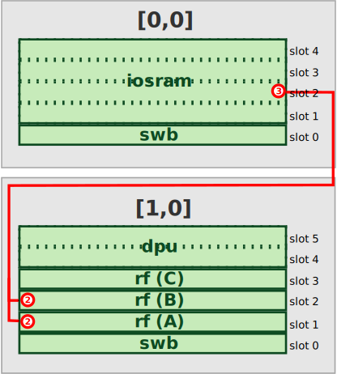

# PASM Language Programming Guide

## Introduction

The Proto-Assembly (PASM) Language is a low-level language that is used to write programs for the DRRA-2 architecture. The language is designed to be simple and easy to understand, while still providing the necessary features to write complex programs. The Proto-Assembly Language are structured assembly language whose instructions are not yet been scheduled. It preserves control hierarchy but lack of timing information. This guide will provide an overview of the language and how to write programs in it. In this guide, you will learn about the syntax of the Proto-Assembly Language, and its constraints.

<!-- prettier-ignore -->
!!! Tip "Syntax Highlighting"
    We highly recommend to install the vscode extension for syntax highlighting of all languages used by the SiLago project. The extension is not published on vscode marketplace since it's still in alpha quality. However, you can download and install it from VSIX package available on [github](https://github.com/silagokth/vscode-extension-slf.git).

## File Types

The Proto-Assembly Language uses the `.pasm` file extension for source files. These files contain the source code for a program written in the Proto-Assembly Language. Inside the `.pasm` file, you can write regions, operations, instructions, as well as constraints that define the behavior of the program. The file is structured in a way that allows for hierarchical organization of the code, making it easier to read and maintain.

The output of the scheduling and synchronization process is a human-readable assembly language file with `.asm` as suffix and a binary file (currently it's in text format for debugging purpose) with `.bin` as suffix. See the following figure:


## Syntax for Proto-Assembly Language

### Comments

Comments in the Proto-Assembly Language are denoted by the `#` character. Anything after the `#` character on a line is considered a comment and is ignored by the compiler.

### Syntax Format

All regions, operations, and instructions follow the same syntax format. The syntax format is as follows:

```
NAME <ID> (PARAM_0=VALUE_0, PARAM_1=VALUE_1, ...) {
    CONTENT_0
    CONTENT_1
    ...
}
```

However, different regions, operations, and instructions requires only some parts of the syntax format. For example, **for_region** usually don't need the `ID` part; Instructions don't have any contents.

For constraints, the syntax is slightly different. The syntax format for constraints is as follows:

```
constraint ("CONSTRAINT CONTENT")
constraint ("CONSTRAINT CONTENT")
...
```

Note that the `CONSTRAINT CONTENT` must be a valid constraint expression that is accepted by minizinc. See [MiniZinc Handbook](https://docs.minizinc.dev/en/stable/index.html) for more information about the constraint syntax.

The following EBNF grammar describes the syntax of the Proto-Assembly Language:

```ebnf
start: (for_region | if_region | epoch_region)*

for_region: "for"   ("<" IDENTIFIER ">")? ("(" parameter ("," parameter)* ")") "{" (for_region | if_region | epoch_region)+ "}"
if_region: "if"   ("<" IDENTIFIER ">")? ("(" parameter ("," parameter)* ")") "{" (for_region | if_region | epoch_region)+ "}" ( "else" "{" (for_region | if_region | epoch_region)+ "}")?
epoch_region: "epoch" ("<" IDENTIFIER ">")? ("(" parameter ("," parameter)* ")")? "{" (cop_region | rop_region | raw_region | constraint)+ "}"

cop_region: "cop" ("<" IDENTIFIER ">")? ("(" parameter ("," parameter)* ")")? "{" instruction+ "}"
rop_region: "rop" ("<" IDENTIFIER ">")? ("(" parameter ("," parameter)* ")")? "{" instruction+ "}"
raw_region: "raw" ("<" IDENTIFIER ">")? "{" instruction+ "}"

instruction: IDENTIFIER ("<" IDENTIFIER ">")? ("(" parameter ("," parameter)* ")")?
constraint: "cstr" \( "\"" ANY "\"" \)
parameter: IDENTIFIER "=" (IDENTIFIER | NUMBER)

IDENTIFIER: /[_a-zA-Z][_a-zA-z0-9]*/
NUMBER: /[+-]?(0[xdob])?[0-9\.]+/

%import common.WS
%ignore WS
COMMENTS: /#.*/
%ignore COMMENTS
```

### Concepts

Regions and instructions are the basic building blocks of a program written in the Proto-Assembly Language. We introduce the following concepts to help you understand the structure of a program written in the Proto-Assembly Language.

- **start** region represents the whole program. It contains one or more regions among **for**, **if**, and **epoch**.
- **for** region is a hierarchical region that contains one or more regions among **for**, **if**, and **epoch**.
- **if** region is a hierarchical region that contains one or more regions among **for**, **if**, and **epoch**.
- **epoch** region is a region that contains one or more operations among **cop**, **rop**, **raw** and **constraint**.
- **rop** or **resource operation** is a region that contains one or more resource instructions.
- **cop** or **control operation** is a region that contains one or more control instructions.
- **raw** or **raw assembly operation** is a region that contains assembly instruction that do not need to be process by the scheduler.
- **control instructions** are instructions that are executed by a sequencer.
- **resource instructions** are instructions that are executed by a specific resource.
- **constraint** is a single line statement that specifies the constraint content. Each constraint is expressed by a relationship among operations, events, and anchors.

<!-- prettier-ignore -->
!!! note
    The Proto-Assembly Language is case-sensitive. All keywords must be written in lowercase.

<!-- prettier-ignore -->
!!! note
    The **raw** region is not compatible with **cop** and **rop** regions. They are not allowed in the same **epoch** region. This is because the instruction scheduling process works on the entire **epoch**.
    Right now, the mix of **cop** and **rop** regions is not supported due to the complexity of the scheduling process. However, it is planned to be supported in a limited capacity in the future.

## Example

In this example, we explain how to write a simple PASM program to perform a 32-element vector multiplication. The program will read two vectors `A` and `B`. It will then compute the element-wise multiplication of the two vectors and write the result to a third vector `C`. The program will be structured using regions, operations, and instructions as described in the syntax format.

First, let's examine the hardware architecture that will be used to run the program. In this example, we use three cells (3 rows, 1 column). The top cell (cell[0,0]) is used as input scratchpad and communicate with the input buffer. The middle cell (cell[1,0]) is used to perform the computation and write the result to bottom cell. The bottom cell (cell[2,0]) is used as output scratchpad and communicate with the output buffer. The hardware architecture is shown in the following figure:


### Step 1: Create the Sceleton of the Program

In this example, the whole program can be written in a single **epoch** region so that all operations in the region can be scheduled together. Inside the **epoch** region, we only need **rop** regions and **cstr** because all the program will be distributed and executed on each resource. We don't need the **sequencer** to make any complicated control flow nor to perform scalar operations. The program can be written as follows:

```
epoch {
    ... // rop regions
    ... // constraints
}
```

### Step 2: Some Important Rules

Before we can write the program, we need to clarify some important rules.

1. In each cell, we have to put a **swb** resource in slot 0 because only in slot 0 we have the interface for intra-cell and inter-cell communication.
2. If a resource needs to access the input buffer or output buffer, it must be placed in the slot 1 because the input/output buffer interface is only available in slot 1.
3. In each slot, we can have max 4 local FSM controllers (called ports) numbered from 0 to 3. The functionality of each FSM controller is defined by each resource specification. We have some conventions for the port functionality assignment, but they are not set in stone. The following table shows the port functionality assignment for a typical single-slot register file resource:

   | Port Number | Functionality                            |
   | ----------- | ---------------------------------------- |
   | 0           | Word-level write port address generation |
   | 1           | Word-level write port address generation |
   | 2           | Bulk-level write port address generation |
   | 3           | Bulk-level write port address generation |

4. Currently, we use a circuit-switched NoC communication system for intra-cell and inter-cell communication. The intra-cell communication (word-level) data chunk is 16-bit, while the inter-cell communication (bulk-level) data chunk is 256-bit. The IO interface also use the same 256-bit data chunk.

### Step 3: Read data from input_buffer to iosram_top

In this step, we will read the input vectors `A` and `B` from the input buffer to the input scratchpad (iosram_top). Since each vector has 32 elements (each element is 16-bit), and each row in input buffer and iosram is 256-bit wide, we need 2 rows to store each vector. The data layout in the input buffer is as follows:

| Row Index | Data in Row    |
| --------- | -------------- |
| 0         | A[0] to A[15]  |
| 1         | A[16] to A[31] |
| 2         | B[0] to B[15]  |
| 3         | B[16] to B[31] |

We want to read the data of `A` and `B` vector chunk of the same index as close as possible. So the reading address order would be: 0-2-1-3. This is a two-level affine addressing scheme which can be expressed by two levels of `rep` instruction.

The iosram is a big resource and it occupies 4 slots. Potentially, we can have max 16 ports or FSMs. However, we only need 6 of them to perform local control:

| Slot/Port   | Functionality                                                                                          |
| ----------- | ------------------------------------------------------------------------------------------------------ |
| slot0/port0 | Address generation for input buffer                                                                    |
| slot0/port1 | Address generation for output buffer                                                                   |
| slot0/port2 | Address generation for internal SRAM when receiving data from input buffer                             |
| slot0/port3 | Address generation for internal SRAM when sending data to output buffer                                |
| slot1/port2 | Address generation for internal SRAM when receiving data from other cells via inter-cell communication |
| slot1/port3 | Address generation for internal SRAM when sending data to other cells via inter-cell communication     |

To read the data from the input buffer to the iosram_top, we need to create a **rop** region that generate address for the input buffer and another **rop** region that generate address for the iosram_top. Therefore, we need to configure **slot0/port0** and **slot0/port2**. Note that, the slot number are relative to the starting slot of the iosram resource. When writing the PASM program, we need to use the absolute slot number. In our case, the absolution slot/port number for reading data from the input buffer to the iosram_top is **slot1/port0** and **slot1/port2** since the iosram resource starts at slot 1. The PASM program for this step can be written as follows:

```
rop <input_r> (slot=1, port=0){
    dsu (init_addr=0)
    rep (level=0, iter=1, step=2, delay=0)
    rep (level=1, iter=1, step=1, delay=0)
}
rop <input_w> (slot=1, port=2){
    dsu (init_addr=0)
    rep (level=0, iter=3, step=1, delay=0)
}
```

Note that, the two **rop** region have different repitition structure. We did a simple trick to re-organize the data when transfer the data from the input buffer to the iosram_top. The reading address is 0-2-1-3 but the writing address is 0-1-2-3. Therefore, the data layout in the iosram_top will be as follows:

| Row Index | Data in Row    |
| --------- | -------------- |
| 0         | A[0] to A[15]  |
| 1         | B[0] to B[15]  |
| 2         | A[16] to A[31] |
| 3         | B[16] to B[31] |

Also note that the `rep` instruction has a field called `iter` which specifies the number of iterations. The number specified in the `iter` field is actually **the total number of iteration minus one**. This means that if we want to read 4 rows of data, we need to set `iter=3`.

Finally, we need to impose a constraint to ensure that the reading and writing operations happen in the same cycle so the transfered data is not lost. The constraint can be written as follows:

```
cstr ("input_r == input_w")
```

Putting all together, the PASM program for this step can be written as follows:

```
epoch {
    rop <input_r> (slot=1, port=0){
        dsu (init_addr=0)
        rep (level=0, iter=1, step=2, delay=0)
        rep (level=1, iter=1, step=1, delay=0)
    }

    rop <input_w> (slot=1, port=2){
        dsu (init_addr=0)
        rep (level=0, iter=3, step=1, delay=0)
    }

    cstr ("input_r == input_w")
}
```

### Step 4: Read data from iosram_top to register files in the middle cell

In this step, we will read the data from the iosram_top to the register files in the middle cell (cell[1,0]). The middle cell has 3 register files from slot 1 to slot 3. Each register file has 4 ports. The register files are used to store the data of vector `A` and `B` and the result vector `C`.

Before we can transfer data, we need to build the routing path from the iosram_top to the register files. The routing path is built by two cooperative **rop** regions. One is for reading data from the iosram_top which will be sent to cell[0,0] and the other is for writing data to the register files in cell[1,0]. The routing path is shown in the following figure:



The PASM program for building the routing path can be written as follows:

```
rop <route0r> (row=0, col=0, slot=0, port=2){
    route (option=0, sr=0, source=2, target= 0b010000000)
}
rop <route1w> (row=1, col=0, slot=0, port=2){
    route (option=0, sr=1, source=1, target= 0b0000000000000110)
}
```

The `route` instruction must exist in pairs. The first `route` instruction is used to build the path inside the sending cell, and the second `route` instruction is used to build the path inside the receiving cell. The `sr` field specifies the sending resource, and the `source` and `target` fields specify the source and target slots of the routing path. The `source` is always binary encoded, while the `target` is always one-hot encoded since there might be multiple receiver. In terms of sending, the `source` is the slot number of the sending resource, and the `target` is the cell direction ranging from 0 to 8 (See the following figure). In terms of receiving, the `source` is the cell direction ranging from 0 to 8, and the `target` is the slot number of the receiving resource.


The compiler supports integer number written in binary, octal, decimal, and hexadecimal formats. The binary format is prefixed with `0b`, the octal format is prefixed with `0o`, the decimal format is prefixed with `0d`, and the hexadecimal format is prefixed with `0x`. When there is no prefix, the number will be considered as decimal. The compiler will automatically convert the number to binary format when generating the assembly code.

The `option` field is used to specify the possible routing configurations that can be switched at runtime. Currently, we support max 4 different options that can be switched by the instruction that implements the **transition transformation operator** (T). In this example, we don't actually need to switch the routing path configuration, so we only configure one option (`option=0`).

Note that the port specified in the `route` instruction is not the ports of the created path. It is the port of the local control FSM inside the SWB resource that configures the routing path. For `route` instruction, it is always port 2, while for `swb` instruction, it is always port 0. The path created by `route` instruction is bulk path (256-bit wide). By default, it always read from port 3 of the sending resource and write to port 2 of the receiving resource. The `route` instruction is used to build the routing path for bulk data transfer.

After we have built the routing path, we can read the data from the iosram_top to the register files in the registers in the middle cell. The two registers are in slot 1 and slot 2. The register in slot 1 is used to store the data of vector `A`, and the register in slot 2 is used to store the data of vector `B`. The PASM program for reading the data and writing the data to the register files can be written as follows:

```
rop <read_ab> (row=0, col=0, slot=2, port=3){
    dsu (init_addr=0)
    rep (iter=2, step=1, delay=0)
}
rop <write_a> (row=1, col=0, slot=1, port=2){
    dsu (init_addr=0)
    rep (iter=1, step=1, delay=t1)
}
rop <write_b> (row=1, col=0, slot=2, port=2){
    dsu (init_addr=0)
    rep (iter=1, step=1, delay=t1)
}
cstr ("route0r < read_ab")
cstr ("route1wr < write_a")
cstr ("route1wr < write_b")
cstr ("read_ab.e0[0] == write_a.e0[0]")
cstr ("read_ab.e0[1] == write_b.e0[0]")
```

In this code segment, we configure one operation to read both vectors `A` and `B` from the top cell. The reading pattern is 0-1-2-3, in total 4 rows. The writing pattern for vector `A` is 0-1, and for vector `B` is also 0-1. Since the reading vector is interleaved to write both register files, we should have a delay in writing operation `t1`. In this case, it is trivial to know that `t1=1`. However, we still create a variable `t1` and let the scheduler to figure out the value of `t1` later. The `cstr` instructions are used to impose constraints on the operations. The constraints ensure that the path is created before the reading and writing operations, and the reading of the first row of vector `A` is the same time as the writing of the first row of vector `A`. The same applies to vector `B`.

Readers might notice that we use some expression to specifically pinpoint an event instance of an operation. For example, `read_ab.e0[0]` means the first instance of the event `e0` of the operation `read_ab`. The `[0]` suffix indicates that this is the first iteration of the loop. The `e0` is the first event of the operation.

### Step 5: Read data from RF, compute, and write result to RF

In this step, we will read the data from the register files in the middle cell, perform the element-wise multiplication of the two vectors `A` and `B`, and write the result to a third vector `C`. The result vector `C` will be stored in the register file in slot 3 of the middle cell. The computation is performed by a DPU resource that is configured to perform element-wise multiplication.

We first need to build the switchbox path to transfer word-level data from the register files to the DPU resource and back to register files. The switchbox path is built by a **swb** resource in slot 0 of the middle cell. The switchbox path is shown in the following figure:


After path is built, we can configure the `DPU` to multiplication mode, read the data from the register files and write the result to the register files. We need to constraint the reading of both vectors `A` and `B` to happens at the same time, and the writing of the result vector `C` to happens exactly 1 cycle after the reading of both vectors `A` and `B`. The PASM program for this step can be written as follows:

```
rop <swb> (row=1, col=0, slot=0, port=0){
    swb (option=0, channel=4, source=1, target=4)
    swb (option=0, channel=5, source=2, target=5)
    swb (option=0, channel=3, source=4, target=3)
}
rop <read_a_seq> (row=1, col=0, slot=1, port=1){
    dsu (init_addr=0)
    rep (iter=31, step=1, delay=0)
}
rop <read_b_seq> (row=1, col=0, slot=2, port=1){
    dsu (init_addr=0)
    rep (iter=31, step=1, delay=0)
}
rop <write_c_seq> (row=1, col=0, slot=3, port=0){
    dsu (init_addr=0)
    rep (iter=31, step=1, delay=0)
}
rop <compute> (row=1, col=0, slot=4, port=0){
    dpu (mode=1)
}

cstr ("read_a_seq == read_b_seq")
cstr ("compute < read_a_seq")
cstr ("swb < read_a_seq")
cstr ("write_c_seq == read_a_seq + 1")
```

### Step 6: Read result from RF and write to bottom cell

In this step, we will read the result vector `C` from the register file in slot 3 of the middle cell and write it to the output scratchpad (iosram_bottom). The iosram_bottom is a resource that is used to store the output data before it is sent to the output buffer. The iosram_bottom has the same structure as the iosram_top, but it is used for output data. The program is similar to the reading step so here we directly write the PASM program for this step:

```
rop <route1r> (row=1, col=0, slot=0, port=2){
    route (option=0, sr=0, source=3, target= 0b0000000010000000)
}
rop <route2w> (row=2, col=0, slot=0, port=2){
    route (option=0, sr=1, source=1, target= 0b0000000000000100)
}
rop <read_c> (row=2, col=0, slot=3, port=3){
    dsu (init_addr=0)
    rep (iter=1, step=1, delay=0)
}
rop <write_c> (slot=2, port=2){
    dsu (slot=2, port=2, init_addr=0)
    rep (slot=2, port=2, iter=1, step=1, delay=0)
}
cstr ("route2w < write_c")
cstr ("route1r < read_c")
cstr ("read_c == write_c")
```

### Step 7: Read data from iosram_bottom to output_buffer

In this step, we will read the data from the iosram_bottom to the output buffer. The output buffer is a resource that is used to store the output data before it is sent to the output device. The iosram_bottom has the same structure as the iosram_top, but it is used for output data. The program is similar to the reading step so here we directly write the PASM program for this step:

```
rop <output_r> (row=2, col=0, slot=1, port=3){
    dsu (init_addr=0)
    rep (iter=1, step=1, delay=0)
}
rop <output_w> (row=2, col=0, slot=1, port=1){
    dsu (init_addr=0)
    rep (iter=1, step=1, delay=0)
}
cstr ("output_r == output_w")
```

### Final PASM Program

The final PASM program for the 32-element vector multiplication can be written as follows:

```pasm
epoch {
    rop <route0r> (row=0, col=0, slot=0, port=2){
        route (option=0, sr=0, source=2, target= 0b010000000)
    }
    rop <input_r> (row=0, col=0, slot=1, port=0){
        dsu (init_addr=0)
        rep (level=0, iter=1, step=2, delay=0)
        rep (level=1, iter=1, step=1, delay=0)
    }
    rop <input_w> (row=0, col=0, slot=1, port=2){
        dsu (init_addr=0)
        rep (iter=3, step=1, delay=0)
    }
    rop <read_ab> (row=0, col=0, slot=2, port=3){
        dsu (init_addr=0)
        rep (iter=3, step=1, delay=0)
    }
    rop <route1wr> (row=1, col=0, slot=0, port=2){
        route (option=0, sr=1, source=1, target= 0b0000000000000110)
        route (option=0, sr=0, source=3, target= 0b010000000)
    }
    rop <write_a> (row=1, col=0, slot=1, port=2){
        dsu (init_addr=0)
        rep (iter=1, step=1, delay=t1)
    }
    rop <write_b> (row=1, col=0, slot=2, port=2){
        dsu (init_addr=0)
        rep (iter=1, step=1, delay=t1)
    }
    rop <swb> (row=1, col=0, slot=0, port=0){
        swb (option=0, channel=4, source=1, target=4)
        swb (option=0, channel=5, source=2, target=5)
        swb (option=0, channel=3, source=4, target=3)
    }
    rop <read_a_seq> (row=1, col=0, slot=1, port=1){
        dsu (init_addr=0)
        rep (iter=31, step=1, delay=0)
    }
    rop <read_b_seq> (row=1, col=0, slot=2, port=1){
        dsu (init_addr=0)
        rep (iter=31, step=1, delay=0)
    }
    rop <write_c_seq> (row=1, col=0, slot=3, port=0){
        dsu (init_addr=0)
        rep (iter=31, step=1, delay=0)
    }
    rop <compute> (row=1, col=0, slot=4, port=0){
        dpu (mode=7)
    }
    rop <read_c> (row=1, col=0, slot=3, port=3){
        dsu (init_addr=0)
        rep (iter=1, step=1, delay=0)
    }
    rop <route2w> (row=2, col=0, slot=0, port=2){
        route (option=0, sr=1, source=1, target= 0b0000000000000100)
    }

    rop <write_c> (row=2, col=0, slot=2, port=2){
        dsu (init_addr=0)
        rep (iter=1, step=1, delay=0)
    }

    rop <output_r> (row=2, col=0, slot=1, port=3){
        dsu (init_addr=0)
        rep (iter=1, step=1, delay=0)
    }

    rop <output_w> (row=2, col=0, slot=1, port=1){
        dsu (init_addr=0)
        rep (iter=1, step=1, delay=0)
    }

	cstr (" input_r == input_w ")
	cstr (" input_w < read_ab ")
	cstr (" route0r < read_ab ")
	cstr (" route1wr < write_a ")
	cstr (" route1wr < write_b ")
	cstr (" read_ab.e0[0] == write_a.e0[0] ")
	cstr (" read_ab.e0[1] == write_b.e0[0] ")
	cstr (" read_ab.e0[2] == write_a.e0[1] ")
	cstr (" read_ab.e0[3] == write_b.e0[1] ")
	cstr (" write_a < read_a_seq ")
	cstr (" write_b < read_b_seq ")
	cstr (" swb < read_a_seq ")
	cstr (" read_a_seq == read_b_seq ")
	cstr (" read_a_seq + 1 > compute ")
	cstr (" write_c_seq == read_a_seq + 1 ")

	cstr (" read_c.e0[0] > write_c_seq.e0[15] ")
	cstr (" read_c.e0[1] > write_c_seq.e0[31] ")

	cstr (" write_c == read_c ")
	cstr (" output_r > write_c ")
	cstr (" output_r == output_w ")
}
```
